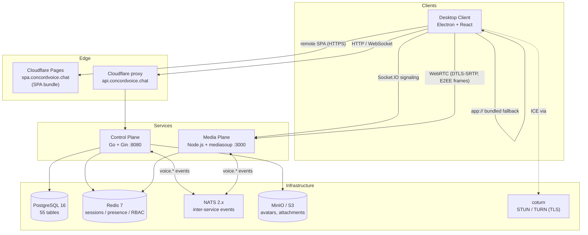
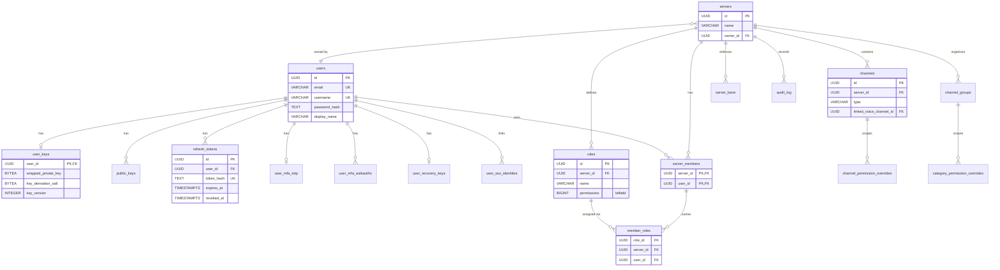
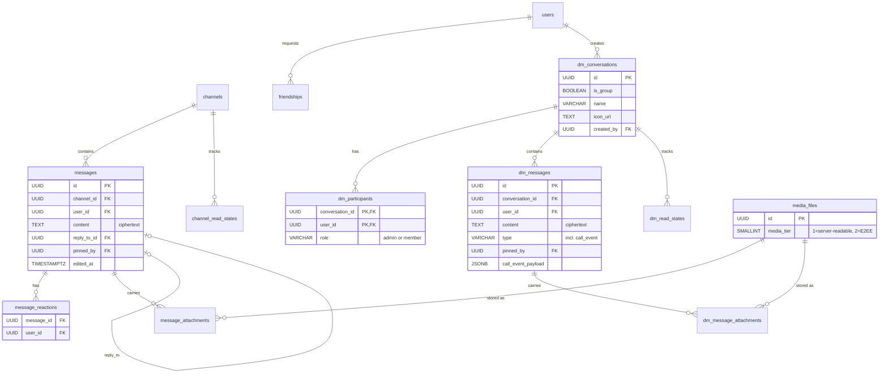
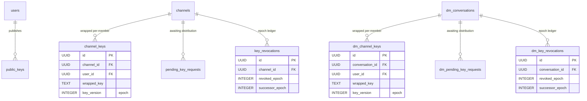
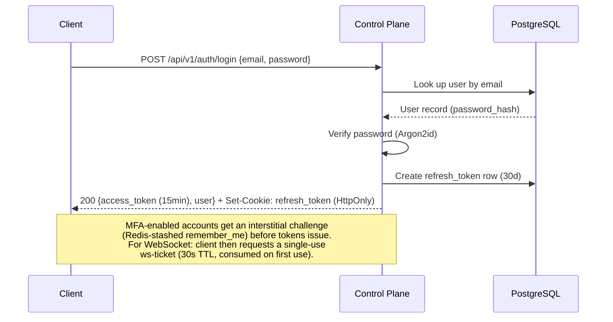
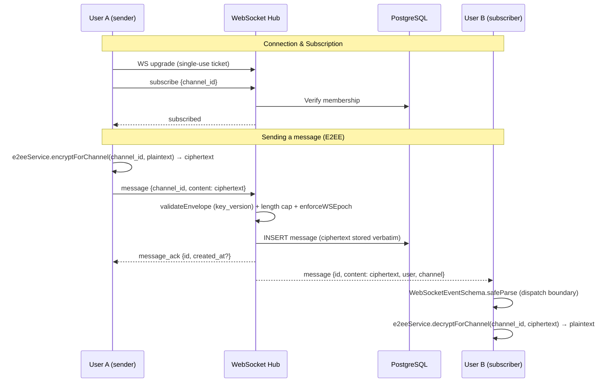
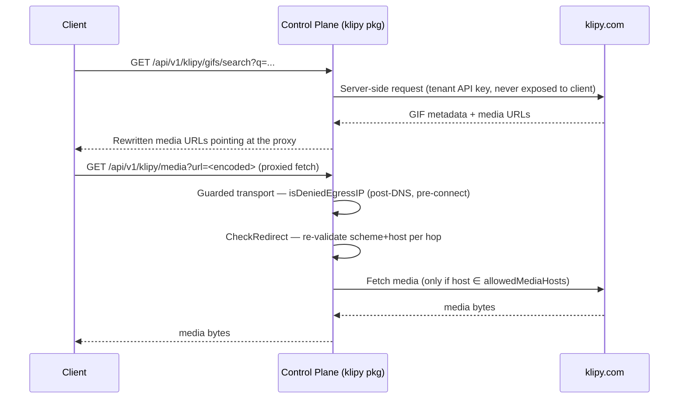
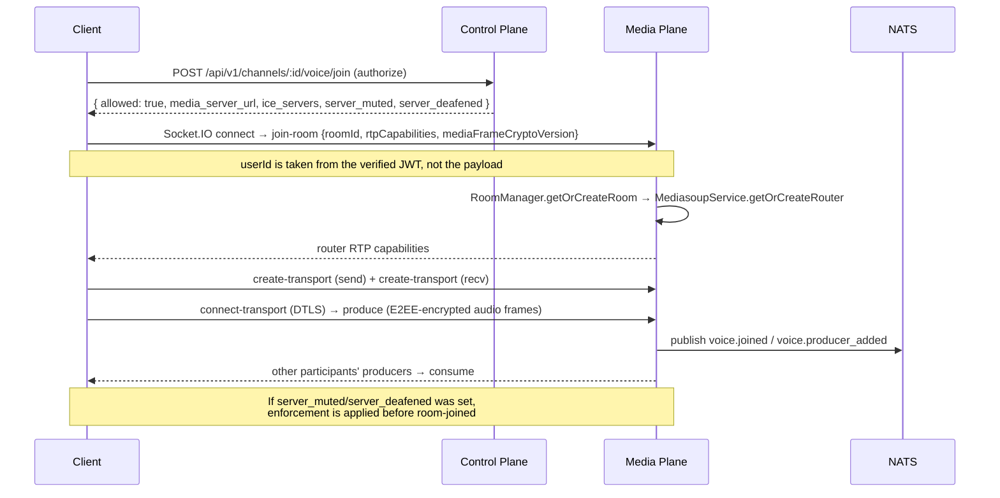
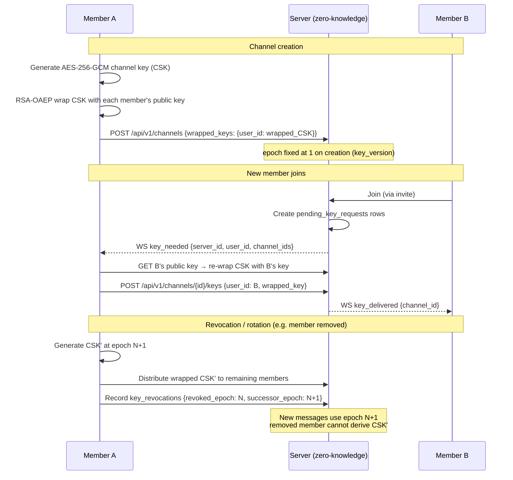
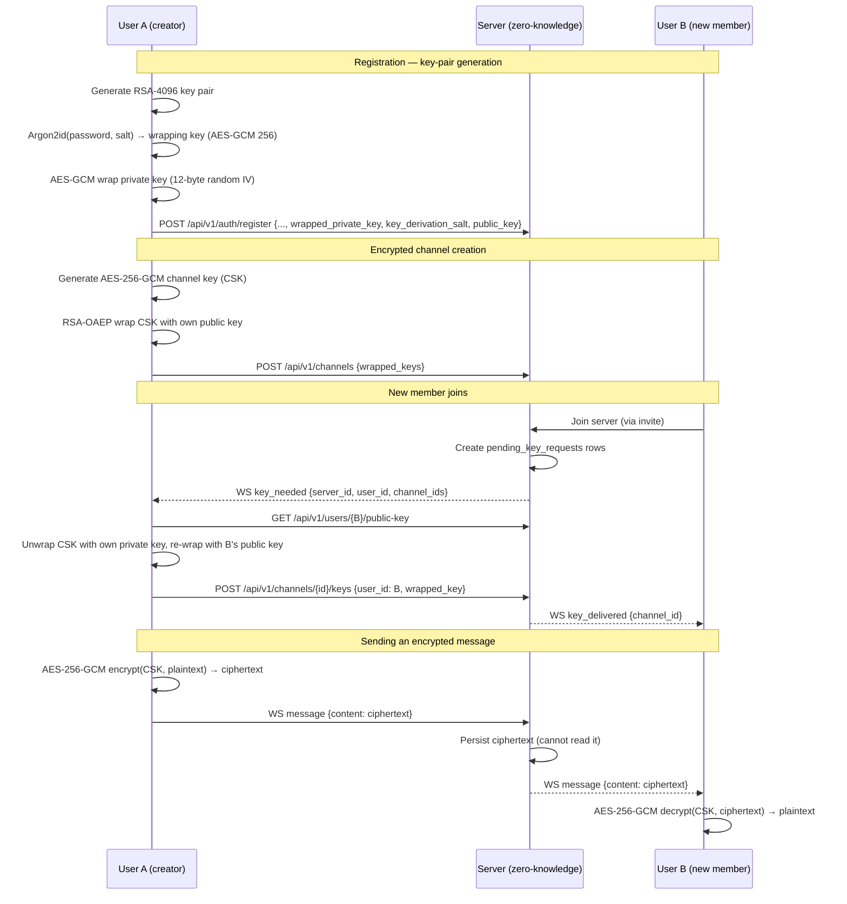

# Concord Voice Architecture

> **Last audited:** 2026-06-10 — counts and code references verified against `main` at this date via `scripts/update-claude-md-counts.sh` and a per-plane source sweep with adversarial claim-by-claim re-verification (issue #587). Cite file paths + symbol names rather than line numbers so this document resists drift.

## Quick Overview

> Summary for AI assistants. For detailed diagrams and schema, see the sections below.

### System Overview

Concord Voice is a distributed real-time communications platform with three service planes:

```text
┌──────────────────────────────────────────────────────────────────┐
│  Desktop Client (Electron + React + TypeScript)                  │
│  - 41 Zustand stores, E2EE via WebCrypto, safeStorage tokens    │
└──────┬────────────────────────────────┬──────────────────────────┘
       │ HTTP/WebSocket :8080           │ Socket.IO + WebRTC :3000
       ▼                                ▼
┌──────────────────────┐    ┌─────────────────────────────────────┐
│  Control Plane (Go)  │    │  Media Plane (Node.js + mediasoup)  │
│  Gin 1.12, 234 routes│    │  WebRTC SFU, Socket.IO signaling    │
│  Auth, RBAC, chat,   │    │  Voice/video routing, RoomManager   │
│  WebSocket hub       │    │  1 router per room, transport/user  │
└──────┬───────┬───────┘    └──────┬──────────────────────────────┘
       │       │                   │
       ▼       ▼                   ▼
┌──────────┐ ┌───────┐      ┌───────┐
│PostgreSQL│ │ Redis │      │ Redis │
│ 16 (79   │ │ 7     │      │ 7     │
│ migr's)  │ │       │      │       │
└──────────┘ └───┬───┘      └───┬───┘
                 │              │
                 └──── NATS ────┘
                   2.x (events)
```

### Service Responsibilities

#### Control Plane (Go + Gin, port 8080)

- User authentication (JWT access 15min + HttpOnly refresh 30d)
- Server/channel/member CRUD, RBAC permission enforcement
- WebSocket hub for real-time messaging and presence
- DM system (8 tables, E2EE with key-epoch enforcement)
- MFA (TOTP, WebAuthn), email verification, ownership transfer
- API route registrations across 20+ route groups; generated counts are checked by `scripts/update-claude-md-counts.sh`

#### Media Plane (Node.js + mediasoup, port 3000)

- WebRTC SFU for voice and video (Opus codec, 7 quality tiers)
- Socket.IO signaling for transport negotiation
- `RoomManager` is authoritative for produce/consume/transport lifecycle
- Frames are E2EE _above_ the SFU (see [Media E2EE](#media-e2ee-frame-encryption)); the SFU forwards opaque RTP
- NATS integration for participant state events to control plane

#### Desktop Client (Electron 42 + React 19)

- Secure IPC via preload bridge (contextIsolation ON, nodeIntegration OFF)
- E2EE: AES-256-GCM message encryption, RSA-OAEP 4096-bit key wrapping
- Token storage via Electron safeStorage (OS keychain)
- 41 Zustand stores for state management
- Adaptive renderer load: remote SPA (Cloudflare Pages) with bundled `app://` fallback

### Data Flow

1. **Authentication:** Client → POST /auth/login (email + password) → JWT pair → access token in memory, refresh token in safeStorage
2. **Messaging:** Client → WebSocket (ticket-auth) → hub routes ciphertext to channel/DM subscribers
3. **E2EE:** Client encrypts (AES-256-GCM) → server relays ciphertext → recipient decrypts
4. **Voice:** Client → Socket.IO signaling → Media Plane (mediasoup SFU) → DTLS-SRTP transport carrying E2EE-encrypted frames → routed to other clients

### Infrastructure

- **Database:** PostgreSQL 16 (schema under `services/control-plane/migrations/`)
- **Cache:** Redis 7 for sessions, presence, RBAC cache, rate limiting (both planes connect to the same server)
- **Messaging:** NATS 2.x for inter-service events
- **CI/CD:** GitHub Actions → SonarQube Quality Gate (≥ 80% coverage)
- **Security:** 41 pre-commit hooks (across 22 repos), SAST (Semgrep), secret detection (gitleaks, TruffleHog)
- **Deployment:** Docker Compose (base + production overlay); SPA on Cloudflare Pages

### Key Design Decisions

- **Privacy-first:** E2EE by default, no server-side plaintext message storage
- **Hybrid deployment:** Same codebase for SaaS and self-hosted
- **Defense in depth:** Electron hardening + CSP + pre-commit secrets + SAST + SonarQube
- **Explicit over implicit:** All error paths handled, all state transitions visible

## Overview

Concord Voice is a distributed real-time communications platform with clear separation of concerns. Three service planes are **implemented and run in production**; a fourth is planned (see [Planned / Not Yet Implemented](#planned--not-yet-implemented)).

1. **Client Layer** — the Electron desktop application (the only shipping client).
2. **Control Plane** (Go) — auth, business logic, RBAC, messaging hub, E2EE ciphertext relay, object-storage proxy.
3. **Media Plane** (Node.js + mediasoup) — WebRTC SFU for voice/video.

The **Licensing Authority** (self-hosted license management) is a Phase-3 planned service and is **not yet built** — its directory is profile-gated out of the production stack.

## High-Level Architecture



## Component Details

### Client Layer

#### Desktop Client (Electron + React + TypeScript)

The desktop client is the only shipping client. Source: `client/desktop/`.

- **Process layout** (`client/desktop/src/` has five top-level source dirs):
  - `main/` — Electron main process: `BrowserWindow` creation, `app://` scheme registration, IPC dispatch, updater wiring, quit lifecycle (`main.ts`); secure token persistence (`tokenManager.ts`); adaptive renderer loading (`spaLoader.ts`); the `app://` resolver (`appProtocol.ts`); device fingerprint (`machineId.ts`); userData path pinning (`pinUserDataPath.ts`); auto-update trust chain (`updater.ts`, `updateSafety.ts`, `verifyWindowsSignature.ts`).
  - `preload/preload.ts` — the single `contextBridge` bridge exposing a minimal typed `window.electron` API.
  - `renderer/` — the React SPA: `stores/` (41 Zustand stores), `services/` (singletons incl. `e2eeService.ts`, `mediaEncryption.ts`, `searchService.ts`, WebSocket, API client, voice), `components/`, `hooks/`, `types/ws-events.ts` (zod WS schema).
  - `shared/` — three cross-process modules: `clientBehavior.ts` (window close/minimize routing), `spaIpcTypes.ts` (self-heal IPC contract), `spaUrlPattern.ts` (the shared SPA chunk-URL regex; the legacy `SPA_URL_PATTERN` was removed by #1657 in favor of runtime base-dir matching).
  - `constants/` — typed constants + build-time generators (e.g. `updateEndpoint.mts`), included in the Istanbul coverage set.
- **Responsibilities:** browser-inspired UI (server bar, channel panel), WebRTC media handling (Opus, 7 quality tiers), voice controls (mute/deafen/PTT, device selection, per-user volume), screen sharing, video calls, E2EE encrypt/decrypt via `e2eeService` (`encryptForChannel` / `decryptForChannel`), secure token storage via `safeStorage`. _(This list is non-exhaustive — the renderer also carries TTS (`ttsService.ts`), keyboard-shortcut customization, OS-permission management (`permissionManager.ts`, macOS screen-recording/mic TCC), and a startup splash window.)_
- **Security posture:** `contextIsolation` ON and `nodeIntegration` OFF unconditionally; no `@electron/remote`. `sandbox` (and `webSecurity`) are ON in packaged builds (`sandbox: isPackaged` in `browserWindowConfig.ts`) and off in dev/unpackaged runs. IPC handlers that reach privileged side effects validate the sender frame via `isPermittedFrameUrl` (`src/main/ipc/frameValidation.ts`).
- **Token storage:** when Remember Me is enabled, the refresh token and E2EE session keys are persisted by `tokenManager.ts` via Electron `safeStorage` (OS keychain — Keychain / DPAPI / libsecret) to `secure-token.dat` / `secure-e2ee.dat` under the pinned userData dir. When Remember Me is disabled, the refresh token **and the E2EE key material** stay in main-process memory only (`inMemoryRefreshToken` / `inMemoryE2EEKeys`) and disk token files are deleted; renderer soft reloads restore both from that process memory (so session-only content stays decryptable across a reload), but app restarts require login. The in-memory E2EE keys are wiped on `clearTokens()`/logout. On every successful session restore the renderer re-runs `hydratePostLogin()` so a session-only soft reload reloads servers/profile/preferences rather than landing authenticated-but-empty (#1870). The access token is **memory-only** (never persisted to disk); it is returned to the renderer via IPC and also cached in main-process memory (`cachedAccessToken`) for proactive refresh.
- **Path identity:** `pinUserDataPath.ts` pins `userData` to `<appData>/ConcordVoice` as `main.ts`'s first import, decoupling the machine path-identity from the mutable display name.
- **Communication:** HTTP/WebSocket → Control Plane; Socket.IO → Media Plane (signaling); WebRTC (DTLS-SRTP carrying E2EE frames) → Media Plane (audio/video).

#### SPA Deploy Lifecycle (ADR-0001, ADR-0015)

The SPA bundle is served by **Cloudflare Pages** at the CONSTANT URL `https://spa.concordvoice.chat/index.html`; serving is decoupled from the Go control-plane. The per-deploy SHA no longer appears in the URL; Pages publishes each deployment atomically and serves the latest at the constant host. The bundle stays decoupled from its serving origin at build time: Vite's `base: './'` makes all chunks resolve relative to the URL `index.html` was loaded from.

The deploy pipeline `wrangler pages deploy`s the renderer bundle to Cloudflare Pages, writes `spa.env` with the constant `SPA_URL` (the per-deploy SHA is recorded as the `SPA_VERSION` annotation only, never in the URL), and commits + pushes `spa.env` back to main via a short-lived, least-privilege (Contents:write) GitHub App installation token.

Five invariants enforce the contract:

1. **Build invariant** — `vite.config.ts` keeps `base: './'`. Locked by `vite-base-relative.test.ts`.
2. **Deploy invariant** — `spa.env` is a generated artifact, verified by a CI contract check. The committed `spa.env` is bind-mounted into the control-plane container as a single file, so the deploy step rsyncs it with `--inplace` (writes the existing inode rather than atomic-rename to a new one) to avoid a stale-inode `spaUrl` class of bug.
3. **Runtime safety net** — the renderer self-heals on chunk-load failures via two-layer detection (renderer-side listeners in `spaSelfHealClient.ts` + main-process `did-fail-load` in `spaSelfHeal.ts` / `spaSelfHealMainFrame.ts`) feeding a shared recovery primitive with R2 retry.
4. **Bundled fallback** — when `spaLoader.ts`'s `resolveSpaSource()` cannot validate the remote SPA (HTTPS + IPC-contract checks fail), it falls back to `mode: 'bundled'`, loading `app://concord/index.html` from the asar bundle. The `app://` scheme is registered privileged (`standard`/`secure`/`supportFetchAPI`/`corsEnabled`) in `main.ts` and resolved by `appProtocol.ts` (host check + path-traversal rejection).
5. **Freshness check** — `clientConfigService.ts` asks main's `spaUpdate.checkForUpdate()` to compare the served entry bytes at startup, every five minutes, on focus, and on visible-resume. If newer bytes are available, it applies through main's `spa:reloadLatest` soft-reload path, which re-runs `resolveSpaSource()` and uses no-cache `net.fetch` / `loadURL` options. Auto-apply is deferred while voice is connecting/connected/reconnecting, screen share is active, or a DM call is ringing/in-call.

The deploy-contract rationale and the move from the Go control-plane to Cloudflare Pages are captured in the project's architecture decision records.

#### Desktop Auto-Update Trust Model

The SPA hot-update path above is distinct from the **binary** auto-update path that ships new Electron app versions. The latter is a security-critical, signature-verified pipeline in `src/main/` (see the [update trust model](policies/update-trust-model.md)):

- **`updater.ts`** — `electron-updater` wiring with `autoDownload = false` (the download is a deliberate, user-gated step, not silent) and prerelease opt-in gating. It pins the certificate chain by monkey-patching `verifyUpdateCodeSignature` to require the Microsoft Trusted Signing intermediate (`updatePinning.ts` / `updatePinningConfig.ts`).
- **`verifyWindowsSignature.ts`** — independent Authenticode signature verification of the downloaded Windows installer.
- **`updateSafety.ts`** — update-safety gating (refuses unsafe transitions) before an update is applied.
- **`userDataMigration.ts`** — migrates the userData tree across versions, tied to the path-identity pinning described above.

Manifests + signed installers are served from the control-plane `updates` package (`GET /api/v1/updates/*`); the trust decisions (signature + cert-chain + safety) all happen client-side in the main process. This is also defended at the transport layer by TLS pinning on `electron-updater`.

### Control Plane (Go)

**Port**: 8080 · Source: `services/control-plane/`

**Tech Stack:** Go 1.26, Gin web framework, PostgreSQL 16, Redis 7, `gorilla/websocket`. The router is assembled in `internal/api/router.go` (`NewRouter`).

**Internal packages** (`services/control-plane/internal/`; count generated by `scripts/update-claude-md-counts.sh`):

| Package         | Responsibility                                                                               |
| --------------- | -------------------------------------------------------------------------------------------- |
| `api`           | Router wiring — assembles all handlers into the Gin engine                                   |
| `attestation`   | Client attestation registry: verify, publish, revoke, cache, OIDC, prune                     |
| `auth`          | Register, login, refresh, logout, recovery flows, WS ticket issuance, SSO adapter            |
| `channels`      | Channel CRUD, key distribution, unread tracking, epoch validation                            |
| `clientconfig`  | Serves dynamic runtime config (SPA URL, media-plane URL, TURN, feature flags, minVersion)    |
| `database`      | PostgreSQL connection + migration runner                                                     |
| `dm`            | DM conversation CRUD, DM messages, DM voice calls (ring/decline/cancel), DM key distribution |
| `email`         | Email sending (verification codes, notifications) via SMTP/Resend                            |
| `friends`       | Friend requests, acceptance/decline, blocking, friend codes                                  |
| `invites`       | Server invite code generation, listing, revoking, joining, preview                           |
| `klipy`         | KLIPY GIF API + media proxy with SSRF egress guard                                           |
| `media`         | Object-store handler: avatar, banner, server-icon, attachment up/download                    |
| `members`       | Server membership: add, update role, remove, ban/unban                                       |
| `messages`      | Channel + DM message CRUD, reactions, pins, embed suppression                                |
| `mfa`           | TOTP, WebAuthn, backup codes, recovery key, trusted devices, recovery circle                 |
| `middleware`    | Auth, CORS, rate-limiting, security headers, attestation gate, request-ID                    |
| `models`        | Shared Go struct types                                                                       |
| `notifications` | Notification mute preferences (per-server/channel/DM)                                        |
| `oauth`         | OAuth 2.0 / OIDC provider integrations for SSO (Google, Apple)                               |
| `ownership`     | Server ownership transfer: initiate, confirm, cancel, reverse                                |
| `privacy`       | GDPR Article 17 account-erasure endpoint                                                     |
| `rbac`          | Role-based access control: resolver, cache, middleware, audit log                            |
| `servers`       | Server CRUD, unread-status aggregation                                                       |
| `sessions`      | Session listing, per-session and all-session revocation                                      |
| `storage`       | S3-compatible (MinIO) client wrapper                                                         |
| `testhelpers`   | Integration-test utilities                                                                   |
| `updates`       | Serves electron-updater manifests + signed installer binaries                                |
| `users`         | User profile, keys, password, SSO identities, search, account deletion, E2EE blob sync       |
| `voice`         | Voice channel join authorization, participants, server-mute/deafen, NATS subscriber          |
| `websocket`     | WS hub, client pump, message dispatch, broadcast routing                                     |

**Responsibilities:** authentication; server/channel CRUD; membership + RBAC; user presence; WebSocket signaling and message relay; E2EE ciphertext relay (the server never decrypts); MFA; SSO; account erasure; object storage; client attestation; rate limiting.

**API:** REST handlers + the single `/ws` upgrade endpoint across 20+ route groups (`/auth`, `/auth/sso`, `/mfa`, `/users`, `/sessions`, `/servers`, `/channels`, `/categories`, `/e2ee`, `/messages`, `/dm/conversations`, `/friends`, `/invites`, `/voice`, `/media`, `/notifications`, `/privacy`, `/klipy`, `/updates`, `/ws`). The Klipy routes register only when `KLIPY_API_KEY` is set; some media routes register a 503 fallback when object storage is unconfigured. See [API Documentation](./api/README.md); generated route counts are checked by `scripts/update-claude-md-counts.sh`.

**E2EE relay (zero-knowledge):** the server relays ciphertext and never decrypts. On the REST path, `messages` handlers (`internal/messages/handlers.go`) validate ciphertext structurally (`isValidCiphertext` — base64 + ≥28-byte decoded length) and enforce epoch revocation (`enforceE2EE`). On the WebSocket path, the hub validates the envelope (`validateEnvelope` — `key_version` present, length cap) and enforces epochs (`enforceWSEpoch` in `internal/websocket/hub.go`); it stores the `content` column verbatim. The E2EE-everywhere posture (#201) removed all per-row `is_encrypted` flags (migration 000062) — encryption is structural, not a runtime branch.

**Outbound SSRF egress guard:** the Klipy media proxy (`internal/klipy/handlers.go`) is the reference SSRF-hardened outbound surface. A cloned transport installs `net.Dialer.Control` running `isDeniedEgressIP` (post-DNS, pre-connect — defends redirect-SSRF + DNS-rebinding with no TOCTOU window; denies loopback / private / ULA / link-local / multicast / CGNAT / deprecated site-local, after `Unmap()`), and `http.Client.CheckRedirect` re-validates scheme + host against `allowedMediaHosts` on every hop.

**WebSocket hub** (`internal/websocket/hub.go`): a single `Run()` goroutine owns the subscription maps (`clients`, `userClients`, `channelSubscriptions`, `serverSubscriptions`, `dmSubscriptions`) and drains buffered broadcast channels. `handleIncoming` dispatches inbound frames by `type` (subscribe, message, typing, presence, DM variants, …); outbound fan-out is `BroadcastToChannel` / `BroadcastToServer` / `BroadcastToUser` / `BroadcastToDM` / `BroadcastToAll`.

#### Database Schema

PostgreSQL 16 (schema under `services/control-plane/migrations/`). Under E2EE-everywhere (#201) the `is_encrypted` columns were dropped (migration 000062) from `channels`, `messages`, `dm_conversations`, `dm_messages`, and `media_files` — they are intentionally absent below.

**Identity, auth, RBAC & server structure:**



**Messaging & DM system (the 8-table DM core created in migration 000026):**



**E2EE key material (epoch-tracked; server channels and DMs are parallel):**



**Supporting tables** (covered for completeness; most carry a simple `user_id → users` FK):

| Domain               | Tables (creating migration)                                                                                                                                                                                                                            |
| -------------------- | ------------------------------------------------------------------------------------------------------------------------------------------------------------------------------------------------------------------------------------------------------ |
| Auth / registration  | `pending_registrations` (000058)                                                                                                                                                                                                                       |
| MFA / recovery       | `user_mfa_totp`, `user_mfa_webauthn` (000029); `user_recovery_keys` (000043); `trusted_recovery_devices`, `recovery_requests` (000044); `recovery_circles`, `recovery_circle_shares`, `recovery_circle_requests`, `recovery_circle_responses` (000045) |
| Profile / prefs      | `user_preferences` (000016); `privacy_settings` (000027); `username_history` (000046); `saved_gifs` (000055); `notification_preferences` (000063, polymorphic target)                                                                                  |
| Voice                | `voice_participants` (000020); `dm_voice_participants` (000026)                                                                                                                                                                                        |
| Media                | `media_files` (000042)                                                                                                                                                                                                                                 |
| Social / server-mgmt | `friend_codes` (000027); `server_invites` (000009); `ownership_transfers` (000047)                                                                                                                                                                     |
| Compliance           | `audit_log` (000035); `account_deletions` (000059)                                                                                                                                                                                                     |
| Attestation          | `release_binaries`, `release_spas` (000066)                                                                                                                                                                                                            |
| Admin console        | `admin_users`, `admin_webauthn_credentials`, `admin_audit_log` (000077) — sessions are Redis-backed (opaque sids), not a table                                                                                                                         |

> Notable schema history: group-DM admin roles added `dm_participants.role` (`admin`/`member`) + `dm_conversations.icon_url` (000053); `dm_messages` gained a `call_event` type + `call_event_payload` JSONB (000064), and the transient `kind` column was dropped in favor of `type` (000065); `account_deletions.sentry_delete_attempted` was dropped (000060) when Sentry was removed; `key_revocations.revoked_by` was changed to `ON DELETE SET NULL` (000059) so account erasure isn't blocked.

#### Admin auth surface (#1688)

The admin console is a **separate identity domain** — it never shares state with end-user auth (no JWT, no `users` table, no refresh tokens).

**Identity:** `admin_users` table (separate from `users`). Admins are created via the `adminctl bootstrap` CLI subcommand inside the running container (first admin only) or via an authenticated in-console `POST /admin/api/v1/admins` (subsequent admins).

**Auth flow (2FA mandatory):**

1. `POST /admin/api/v1/auth/password` — constant-time password verify; returns a short-lived challenge handle + WebAuthn `BeginLogin` assertion. **Password alone never yields a session.**
2. `POST /admin/api/v1/auth/webauthn` — `FinishLogin` with `userVerification: required`; on success mints an opaque Redis session.

**Sessions:** 256-bit CSPRNG session id stored in Redis under `admin_session:{sid}`. Cookie `__Host-cv_admin_sid`: `Secure; HttpOnly; SameSite=Strict; Path=/`. Idle TTL 30 min (sliding); absolute cap 8 h. Logout `DEL`s the key (instant revocation). The `AdminAuthRequired` middleware validates the cookie → Redis → expiry on every `/admin` route.

**Hardware key requirement:** `attestation: direct` is enforced at enrollment; the AAGUID is checked against `ADMIN_WEBAUTHN_ALLOWED_AAGUIDS` (canonical YubiKey 5-series set). Only approved hardware keys can become admin credentials.

**Lockout:** per-account + per-IP exponential backoff in Redis (IP is **hashed**, not stored raw) after 5 consecutive failures.

**Audit log:** `admin_audit_log` table — append-only, records every auth outcome and admin action with a sanitized actor identifier and opaque source reference. Never records passwords, assertion bytes, raw IPs, or end-user PII.

**Dormancy:** the entire surface is gated by `ADMIN_CONSOLE_ENABLED` (default `false`). All `/admin/*` routes return 404 when disabled. See the "Post-deploy: bootstrap the first admin (#1688)" section in the deploy runbook for provisioning.

**Hosted edge-gating:** hosted admin traffic is wrapped by Cloudflare Access (identity allowlist + hardware-key requirement) before origin, then nginx serves the codename vhost with a Cloudflare Origin Certificate, and the Go `/admin` route group verifies `Cf-Access-Jwt-Assertion` against the Access JWKS/audience before any admin handler runs. The origin firewall helper restricts `:443` to Cloudflare IP ranges. The codename hostname is not the access control; app auth and CF Access both still gate known-host requests.

**Config env vars** (all `vars.*`, non-secret): `ADMIN_CONSOLE_ENABLED`, `ADMIN_WEBAUTHN_RP_ID`, `ADMIN_WEBAUTHN_RP_ORIGINS`, `ADMIN_WEBAUTHN_ALLOWED_AAGUIDS`, `CF_ACCESS_AUD`, `CF_ACCESS_TEAM_DOMAIN`.

### Media Plane (Node.js + mediasoup) ✅ Implemented

**Port**: 3000 · **RTC ports**: 40000–40099/UDP (dev), 40000–41999/UDP (production) · Source: `services/media-plane/`

**Tech Stack:** Node.js 24, mediasoup 3.20, Socket.IO 4.8, NATS 2.x, `redis` (node-redis) client 6.x connecting to the shared Redis 7 server. The builder stage uses a custom GHCR base image (`ghcr.io/concord-voice/node-buildtools`, digest-pinned) that pre-bakes the mediasoup native-compile toolchain.

**Responsibilities:** WebRTC media routing (SFU — no mixing/transcoding); Opus audio with 7 quality tiers; per-room router management; transport/producer/consumer lifecycle; server-mute/deafen enforcement; NATS event publishing. The SFU forwards opaque, E2EE-encrypted RTP frames (see [Media E2EE](#media-e2ee-frame-encryption)).

**Component split (authoritative vs. infrastructure):**

- `MediasoupService` (`src/lib/mediasoup.ts`) owns **workers and routers only** — `init()` creates the worker pool, `getOrCreateRouter(roomId)` / `removeRouter(roomId)` manage one router per room. It holds no participant state.
- `RoomManager` (`src/lib/roomManager.ts`) is **authoritative for everything else** — `joinRoom` / `leaveRoom`, `createTransport`, `connectTransport`, `produce` / `consume`, producer/consumer pause/resume/close, and the server-mute/deafen methods. `MediasoupService` is injected as a dependency. The `Room` struct carries `{ id, router, audioLevelObserver, participants, createdAt, e2eeEpoch, mediaFrameCryptoVersion }` — **no `isEncrypted` field**.

**Transport encryption is structurally mandatory.** All transports are created via `router.createWebRtcTransport` (DTLS-SRTP by construction); there is no `createPlainRtpTransport` path and no per-room encryption flag anywhere in `src/`. The `e2eeEpoch` counter increments unconditionally on every join/leave for forward-secrecy signaling.

**Origin gate.** The Socket.IO `cors.origin` callback (`src/lib/originGate.ts`) maintains semantic parity with the control-plane CORS middleware: no-Origin → allow; `'null'` / `'file://'` → reject (case-insensitive, whitespace-tolerant); allowlist or `'*'` → allow; else reject. A production guard in `src/config/index.ts` fatal-exits if `ALLOWED_ORIGINS` contains `'*'` while `ENVIRONMENT=production` (CWE-942).

**Socket.IO events:** `join-room`, `update-rtp-capabilities`, `create-transport`, `connect-transport`, `produce`, `consume`, `request-keyframe`, `set-preferred-layers`, `update-test-status`, `pause-producer` / `resume-producer`, `close-producer`, `pause-consumer` / `resume-consumer` / `close-consumer`, `leave-room`; room broadcasts include `participant-testing-changed` and `camera-layering-gate`. `join-room` carries `mediaFrameCryptoVersion`; the media plane runs a higher-version-wins admission gate (room version = MAX of advertised versions; a lower-version joiner is rejected with a typed `CryptoVersionMismatchError`) before storing the participant (#1878). `join-room` participant summaries carry `isTesting` so clients can render in-call device tests. `request-keyframe` lets a receiver ask the SFU to request a fresh video keyframe from a target sender after E2EE epoch recovery; the media plane validates room membership and applies a 5s per-sender cooldown before calling mediasoup `consumer.requestKeyFrame()` (PLI/FIR). `set-preferred-layers` carries receiver render demand for camera consumers (`consumerId`, desired layers, visibility, CSS size, device pixel ratio, role/focus/pressure flags); the media plane verifies ownership, video kind, camera source, entitlement layer cap, and only calls mediasoup `consumer.setPreferredLayers()` for simulcast/SVC consumers. The resulting server-owned `camera-layering-gate` broadcast tells clients when layered camera production is beneficial for the room. The `resume-producer` / `resume-consumer` handlers enforce `server_muted` / `server_deafened`. (Voice quality tiers are applied client-side via producer `codecOptions`, not a Socket.IO event.)

#### Media E2EE (frame encryption)

Voice and **video frames are end-to-end encrypted above the SFU** — the media plane never sees plaintext media. This is a separate layer from transport DTLS-SRTP (which terminates _at_ the SFU). Implementation: `client/desktop/src/renderer/services/mediaEncryption.ts` (+ `voiceE2eeTransforms.ts`):

- **Cipher:** per-frame **AES-256-GCM** applied via WebRTC **Insertable Streams** before frames leave the sender — `RTCRtpScriptTransform` (Web Worker) on Chromium 129+, `createEncodedStreams` (main thread) on the legacy path.
- **Frame keys:** derived `HKDF-SHA256(channelCSK, salt="concord-voice-e2ee", info=senderUserId)` from the **same channel CSK** used for text messages — so media encryption shares the `channel_keys` / `key_revocations` epoch ledger and rotates on member join/leave (with a short overlap window), and ratchets via `HKDF(oldKey, "concord-e2ee-ratchet")`.
- **Frame-format admission (v3, #1878):** the desktop advertises `MEDIA_E2EE_FRAME_CRYPTO_VERSION = 3` on `join-room`; the media plane (`SUPPORTED_MEDIA_FRAME_CRYPTO_VERSION = 3`) runs a **higher-version-wins** admission gate before storing the participant, running reconnect cleanup, or bumping the room E2EE epoch. The room version is the **MAX** of advertised versions — an empty room seeds with the first joiner's version, a higher-version joiner ratchets the room **up**, and a lower-version joiner is rejected with a typed `CryptoVersionMismatchError` (`code: 'crypto_version_mismatch'`, `{roomVersion, joinVersion}`) which the join handler returns as an actionable ack → the client shows "update required". The ACCEPTED set is `{2, 3}` during the v2→v3 rollout window (v1/AES-128 permanently rejected; v2 dropped post-rollout — tracked follow-up). **Rollout caveat:** during that window a v3 client joining a room with a *live* v2 participant ratchets the room to v3 but does **not** evict the v2 peer, so that peer's frames are mutually undecryptable (silent media degradation) until it rejoins on an updated build — an accepted OQ-1/Decision-A tradeoff.
- **Framing and fail-closed receive:** each frame carries a **21-byte trailer** (`TRAILER_SIZE_V3`): `[headerBytes:1][keyId:2 BE][keyVersion:4 BE][IV:12][magic:2]`. The `keyVersion` field (the channel-key version) is the #1878 fix — receivers key their decrypt map by `senderId:keyVersion:keyId` and derive the exact key deterministically across mid-session CSK rotations, fixing the ratchet-base desync that black-screened video. The trailing `0xDE 0xAD` magic + self-describing header bytes distinguish encrypted frames and survive BUNDLE payload-type collisions; AES-GCM is used **without** AAD (intentional — the header travels in the clear, so the stamped `keyVersion` only *selects* the key and a tampered flip fails closed to a frame drop). Receivers reject every non-empty frame without the E2EE magic trailer, while allowing empty DTX/control frames. If a decrypt transform cannot attach, `voiceService` closes the consumer before store routing or server resume; attached transforms drop undecryptable frames and use self-healing recovery for transient key-rotation gaps.
- **Video keyframe recovery:** when the receiver detects a missing or stale media decrypt key, `voiceService` pre-installs target-epoch decrypt keys for active participants, catches the worker up to the server epoch, and emits `request-keyframe { senderUserId }` for the affected video sender. The media plane validates requester/sender membership, finds the matching video consumers, and calls mediasoup `consumer.requestKeyFrame()` under the 5s per-sender cooldown.
- **Media plane is blind by design:** no frame-crypto code exists in `services/media-plane/src/`; the SFU forwards opaque encrypted RTP payloads.

## Data Flow Examples

### User Authentication



### Channel Message Flow (with client-side validation)



> **Client-side dispatch validation (PR #1184, closes #709).** Every inbound envelope is validated by `WebSocketEventSchema` (a zod 4 discriminated union over `type`) before any per-handler dispatch in `client/desktop/src/renderer/services/websocketService.ts`. Failed envelopes are dropped with a PII-scrubbed structural log (`scrubZodIssues`) and `connectionStore.wireViolationCount` is incremented. Handlers in `useWebSocketMessages.ts` operate on already-narrowed payloads. The `isInitialized` guard on `e2eeService` makes decryption fail-closed (render-as-error) if keys aren't ready, never leaking ciphertext.

### Message Search (client-side, E2EE-native)

Because the server holds only ciphertext, full-text **message search runs entirely in the renderer**. `searchService.ts` builds an in-memory MiniSearch index over _decrypted_ message content — no plaintext is written to disk or sent to the server. The client backfills the index by pulling ciphertext from a rate-limited bulk-fetch endpoint and decrypting locally; the index is memory-only, capped at ~50K messages / ~3MB with per-channel LRU eviction. (User-search and Klipy GIF-search, by contrast, are server-side.)

### Encrypted Cross-Device Sync

User **preferences** and **saved GIFs** sync across devices as opaque E2EE blobs — the server stores ciphertext here too, not just for messages. The control-plane `users` package exposes a generic encrypted-blob surface (`GET`/`PUT /api/v1/users/me/preferences` and `/me/saved-gifs`) storing an `encrypted_data` column with version-based optimistic concurrency and a WebSocket broadcast (`preferences_updated` / `saved_gifs_updated`) on change. The client encrypts/decrypts via `e2eeService` through `e2eeBlobTransport.ts` (`preferencesSync.ts` / `savedGifsSync.ts`).

### DM Message Pinning

DM messages support pinning like channel messages: `dm_messages.pinned_by` (migration 000057) records the pinning user. Pin/unpin live in the **`messages`** package (`POST` / `DELETE /api/v1/messages/:id/pin`); the handler branches to `pinDMMessage` / `unpinDMMessage` for DM messages. Pinned-message decryption flows through the same `e2eeService` path (`pinnedMessageUtils.tsx`).

### Klipy GIF Proxy



The client never calls the Klipy API directly — the tenant key stays server-side and all media is proxied through the SSRF-guarded surface. Privacy-preserving by construction.

### Joining a Voice Channel



Audio is forwarded as-is (SFU, no transcoding) for low latency; frames are E2EE (see [Media E2EE](#media-e2ee-frame-encryption)). Redis holds crash-safe room membership (`voice:room:{channelId}` SET, `voice:user:{userId}` HASH, both 120s TTL).

### DM Voice Calls & Ringing

DM 1:1 / group calls have a distinct **ring lifecycle** from server-channel voice. The control-plane `dm` package (`voicering.go`, `call_events.go`) drives ring → accept / decline / cancel / timeout over WebSocket + routes under `/api/v1/dm/conversations` (`…/voice/ring`, `…/voice/decline`, `…/voice/cancel`). Call outcomes are persisted as `dm_messages` rows with `type = 'call_event'` and a `call_event_payload` JSONB (migrations 000064–000065), so the call history renders inline in the DM timeline. The media path itself reuses the same mediasoup SFU + `dm_voice_participants` as channel voice.

### Server Mute / Deafen

Moderation mute/deafen is enforced in the media plane but driven by the control plane over NATS. The control-plane `voice` package publishes `voice.enforce.mute` / `voice.enforce.deafen`; the media-plane NATS subscriber (`src/index.ts`) calls `RoomManager.serverMuteUser` / `serverDeafenUser`, which pause the participant's audio producers (and, for deafen, audio consumers) and set `serverMuted` / `serverDeafened` flags. The flags also block `resume-producer` / `resume-consumer` so a client cannot self-unmute. State changes broadcast `server-mute-changed` / `server-deafen-changed` to the room.

### E2EE Key-Epoch Rotation



Server channels (`channel_keys` / `key_revocations`) and DMs (`dm_channel_keys` / `dm_key_revocations`) use parallel epoch ledgers. Media E2EE mirrors the same epoch discipline: the media plane includes the authoritative `e2eeEpoch` in `join-room` responses and `user-joined` broadcasts, and the desktop client installs target-epoch decrypt keys on join/leave/epoch-sync before worker catch-up to reduce dropped encrypted video frames. Epoch gaps above the local ratchet limit fail closed and require rejoin instead of installing an epoch-0 fallback key. The `CHECK(successor_epoch > revoked_epoch)` constraint is present on `dm_key_revocations` (migration 000041); on `key_revocations` the constraint was added only in a re-declaration (000035) that is a no-op once the table exists from 000028, so it may be absent on already-migrated databases.

### Account Erasure Cascade

`POST /api/v1/privacy/erase-account` (the `privacy` package → `users.DeleteAccount`) runs a single transaction: `DELETE FROM users WHERE id = $1`. Every user-owned table FKs `users(id) ON DELETE CASCADE`, so refresh tokens, keys, memberships, messages, and DM data are removed atomically — strictly stronger than the soft-revoke in `ChangePassword` (no token residue). A NULL-`user_id` audit row is written to `account_deletions`.

### Runtime Client Configuration

The desktop client discovers its runtime config — it is **not** hardcoded. `clientConfigService.ts` polls the public (pre-auth) `GET /api/v1/client/config` (`internal/clientconfig`) every ~5 minutes for: `minVersion` (a client-gate enforced regardless of auth state), server-toggled `featureFlags` (currently `gifsEnabled` only — the inert `voice`/`video`/`e2ee` members were removed under #1649), the **media-plane URL**, **TURN** host/realm, the `spaUrl`, and `spaIpcContract`. This is how the media-plane and TURN endpoints reach the client; the `gifsEnabled` flag mirrors the server-side `KLIPY_API_KEY` gate.

## Deployment Models

### SaaS (Cloud-Hosted)

Production runs the Docker Compose stack on a VM behind the Cloudflare proxy (`api.concordvoice.chat`), with the SPA bundle served separately by Cloudflare Pages (`spa.concordvoice.chat`).

```text
Desktop client
   │
   ├── SPA bundle ───────────► Cloudflare Pages (spa.concordvoice.chat)
   │
   └── API / WebSocket ──────► Cloudflare proxy ──► VM
                                                     ├── control-plane :8080
                                                     ├── media-plane   :3000 (WebRTC UDP direct)
                                                     ├── PostgreSQL 16
                                                     ├── Redis 7
                                                     ├── NATS 2.x
                                                     ├── MinIO (object storage)
                                                     └── coturn (STUN/TURN, TLS)
```

The Cloudflare proxy in front of `api.concordvoice.chat` is load-bearing for the updates cache and rate limiting (it must stay proxied, not DNS-only). The 3-Dockerfile production-active stack is postgres (`infrastructure/docker/postgres/Dockerfile`), control-plane, and media-plane; built via `docker compose -f docker-compose.yml -f docker-compose.production.yml --profile services build`.

### Self-Hosted (Docker Compose)

The same `docker-compose.yml` (base) + `docker-compose.production.yml` (overlay) runs the full stack on a single server. Production-required variables use fail-loud `${VAR:?msg}` interpolation so a misconfiguration fails at `docker compose config` time rather than at runtime.

**Requirements:** 4+ CPU cores, 8+ GB RAM, 50+ GB storage, public IP for WebRTC, UDP 40000–41999 open. The `coturn` service provides STUN/TURN with TLS (cert provisioning via a certbot deploy hook).

Dev/test services (`pgadmin`, `redis-commander`) are gated behind the `tools` compose profile; `licensing-authority` behind the `licensing` profile (not production-active).

## Security Architecture

### Authentication & Authorization

- Email + password with **Argon2id** hashing (t=3, m=64MB, p=4); username validation with profanity/leetspeak filtering. Login authenticates by **email**.
- **JWT access tokens** (15-minute TTL) + **refresh tokens** (30-day rolling) in HttpOnly cookies (`internal/auth/`).
- **WebSocket auth:** single-use ticket (30s TTL, consumed on first use).
- **MFA (implemented):** TOTP, WebAuthn, backup codes, recovery key, trusted devices, and social recovery circles (`internal/mfa/`).
- **SSO (implemented):** OAuth 2.0 / OIDC for Google and Apple (`internal/oauth/`; auth-side integration in `internal/auth/oauth_adapter.go`).
- **RBAC:** `internal/rbac/` resolves effective permissions from `server_members` / `member_roles` joined to `roles` (a `permissions` BIGINT bitfield, `BIT_OR`-aggregated) plus channel/category overrides (`channel_permission_overrides` / `category_permission_overrides`), enforced by `RequireMembership` / `RequirePermission` middleware, cached in Redis, and audited to `audit_log`.
- **Rate limiting:** Redis-based, per-IP and per-user (`internal/middleware/`).
- **Client attestation:** server- and client-side. The client (`src/main/attestationService.ts` + `attestationSignals.ts`) collects device/build signals, POSTs them to obtain a short-lived `attestation_token` (cached until expiry), and presents it to gated routes; failures surface via `attestationFailureStore`. The server (`internal/attestation/`) verifies tokens and gates authenticated routes when enabled (fail-closed on Redis error); release provenance is recorded in `release_spas` / `release_binaries` (migration 000066).

### Transport & Media Security

- **Signaling:** TLS 1.2+/1.3 (HTTP/WebSocket) — the nginx/Cloudflare termination layer permits TLS 1.2 minimum, TLS 1.3 preferred.
- **Media (two layers):** DTLS-SRTP at the WebRTC transport layer (structurally mandatory in the media plane — no plaintext RTP path) **plus** application-layer **E2EE frame encryption** above the SFU (see [Media E2EE](#media-e2ee-frame-encryption)). The SFU sees neither plaintext media nor frame keys.
- **TURN:** coturn with TLS listeners (5349, and 443 alternate) for restrictive networks; HMAC ephemeral credentials.

### E2EE Key Flow



- RSA-OAEP 4096-bit key wrapping; AES-256-GCM message encryption; Argon2id key derivation (the password-derived wrapping key is an AES-GCM 256 key; the private key is wrapped with AES-GCM, not RFC 3394 AES-KW). The registration-time key material (`public_key`, `wrapped_private_key`) is uploaded as part of `POST /api/v1/auth/register`; `GET`/`PUT /api/v1/users/me/keys` cover re-wrap on password change and key recovery.
- Public keys stored in PostgreSQL; private keys are wrapped client-side and never leave the client unwrapped.
- Encryption is **structural** under E2EE-everywhere (#201): every channel and DM is encrypted by construction — there is no plaintext/encrypted toggle and no `is_encrypted` column. Voice/video frames are likewise E2EE (see [Media E2EE](#media-e2ee-frame-encryption)).

### Data Privacy

- **No telemetry pipeline** (see [Logging Discipline](#logging-discipline)).
- No voice-content retention (SFU forwards, never records; frames are E2EE end-to-end).
- E2EE-everywhere: the server stores only ciphertext for messages, DMs, and synced user-state blobs (preferences, saved GIFs).
- **GDPR Article 17 erasure** is implemented (`POST /api/v1/privacy/erase-account`, atomic cascade).
- Privacy-first architecture from day one; see [`docs/policies/`](policies/).

## Logging Discipline

Concord has **no telemetry, tracing, or metrics pipeline** — there is no Prometheus, Loki, Grafana, Jaeger, or Sentry (Sentry was removed entirely on 2026-04-22; the `account_deletions.sentry_delete_attempted` column was dropped in migration 000060). What remains is _logging hygiene_: services emit structured logs to stdout, governed by a logging-discipline rule.

Core logging rules (enforced by lint + AST regression tests, not convention):

- **No key material** — channel/DM/session keys, RSA private keys, JWT/refresh tokens, password hashes never reach any log sink, in any form. Locked in `services/control-plane/internal/auth/` by an AST-walking test (`log_emissions_test.go`).
- **No PII** — emails, real-name fields, IP addresses (where avoidable) are redacted in error paths.
- **No `Error.cause` propagation** (Electron main) — raw `err` objects are never passed to `console.error`/`console.warn`; ES2022 `Error.cause` can carry secrets upward. Enforced by an ESLint `no-restricted-syntax` rule scoped to `client/desktop/src/main/**`.
- **No raw wire-violation payloads** — WebSocket schema-rejection logs emit only structural metadata (the envelope `type` + `scrubZodIssues`-scrubbed `{code, path, message}`), never received field values.
- **No unsanitized control characters (CWE-117)** — user-derived strings are run through `sanitizeLogValue` (`internal/websocket/logsanitize.go`) before interpolation into stdlib `log.Printf`.

## Key Directories

```text
Concord/
├── client/desktop/           # Electron + React + TypeScript (the shipping client)
│   ├── src/main/             # Electron main process (IPC, updater trust chain, app:// scheme, tokens)
│   ├── src/preload/          # Secure contextBridge IPC bridge
│   ├── src/renderer/         # React app (stores/, services/, components/, hooks/)
│   ├── src/shared/           # Cross-process types (clientBehavior, spaIpcTypes, spaUrlPattern)
│   └── src/constants/        # Typed constants + build-time generators
├── services/
│   ├── control-plane/        # Go backend (generated internal-package count; migrations/)
│   ├── media-plane/          # Node.js mediasoup WebRTC SFU (src/lib/ RoomManager, mediasoup)
│   └── licensing-authority/  # Planned (Phase 3) — profile-gated, not production-active
├── infrastructure/
│   ├── deploy/               # deploy-spa.sh, copy-certs.sh, provisioning
│   └── docker/               # postgres, coturn, buildtools base images
├── scripts/                  # Dev scripts, git hooks, count generator, drift lints
└── docs/                     # architecture.md (this file), adr/, api/, policies/, runbooks/
```

## Technology Decisions Summary

| Component      | Technology                              | Rationale                                                           |
| -------------- | --------------------------------------- | ------------------------------------------------------------------- |
| Desktop client | Electron 42 + React 19 + TS 6           | Mature WebRTC, fast iteration, OS keychain access                   |
| Control plane  | Go 1.26 + Gin                           | Fast, concurrent, single-binary deploy                              |
| Media plane    | Node.js 24 + mediasoup 3.20             | Best-in-class WebRTC SFU                                            |
| Database       | PostgreSQL 16                           | Relational + JSONB, mature, declarative partitioning available      |
| Cache          | Redis 7 (server; node-redis 6.x client) | Sessions, presence, RBAC cache, rate limiting, voice room state     |
| Messaging      | NATS 2.x                                | Lightweight inter-service voice events                              |
| Object storage | MinIO / S3                              | Avatars, banners, attachments (tiered: server-readable vs E2EE)     |
| SPA serving    | Cloudflare Pages                        | Atomic deploys, decoupled from the control plane (ADR-0015)         |
| Auth           | JWT + HttpOnly refresh                  | Stateless access, revocable refresh                                 |
| GIF search     | Klipy (privacy proxy)                   | Tenant key + SSRF-guarded server-side proxy; no direct client calls |

## Planned / Not Yet Implemented

These describe intended future work — **not** current architecture. They are kept here so contributors can distinguish shipped reality from roadmap.

- **Licensing Authority** (Go, port 8082) — signed-license generation/validation and periodic check-ins for self-hosted instances. Directory exists but is profile-gated out of production (Phase 3).
- **Web client (PWA)** — a browser client sharing renderer code with the desktop app. Not built; the desktop client is the only shipping client.
- **Kubernetes / multi-region** — Helm charts, horizontal pod autoscaling, geographic DNS routing, and read-replica fan-out for a multi-region SaaS. Current production is a single-VM Docker Compose deployment.
- **`messages`-table partitioning** — declarative hash-partitioning by `channel_id` is specified but deliberately **not** implemented; it is gated on concrete trigger criteria (query p99 > 100ms, any channel > 100k messages, or > 10M rows with observed bloat). Earliest candidate: v1.2.0.
- **Performance SLOs** — no formal latency/capacity targets are published yet; figures should be measured before they are documented (the previous version of this section contained aspirational numbers that were never instrumented).
- **Enterprise SSO** (LDAP, SAML 2.0) and additional disaster-recovery automation are tracked for later releases.

## Next Steps

- [API Documentation](./api/README.md) — OpenAPI 3.0 spec (partial; full regeneration tracked separately)
- [Development Guide](./development.md) — local setup, running tests
