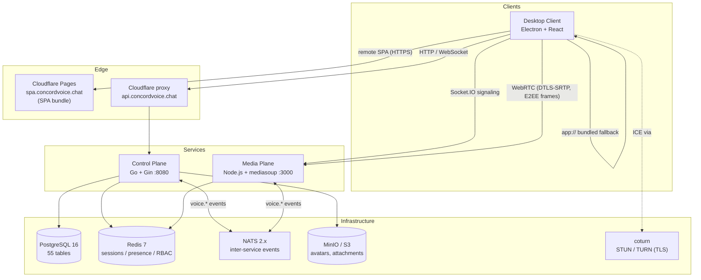
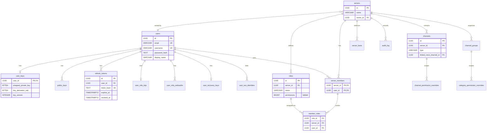
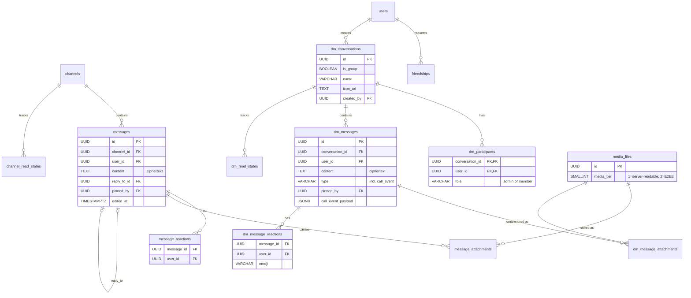
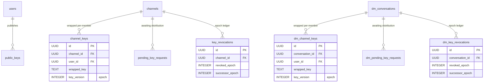
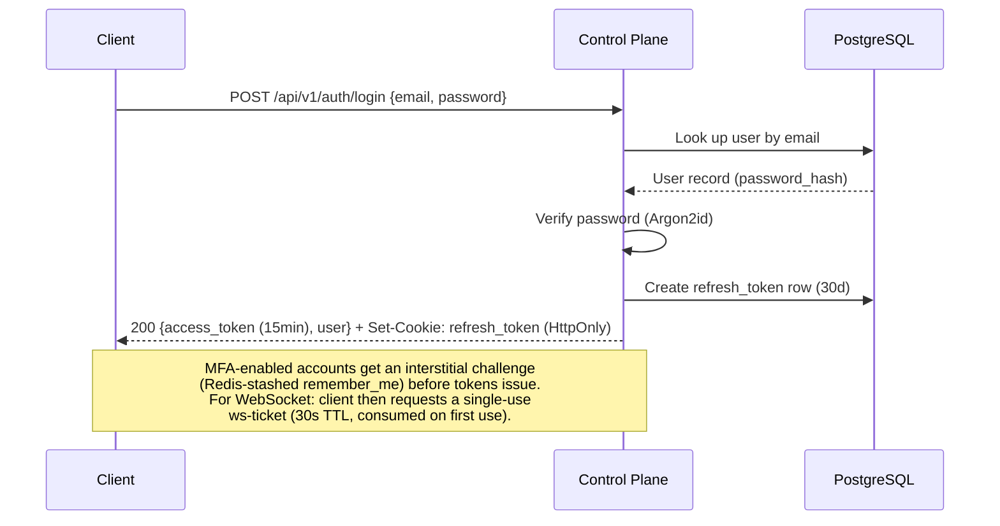
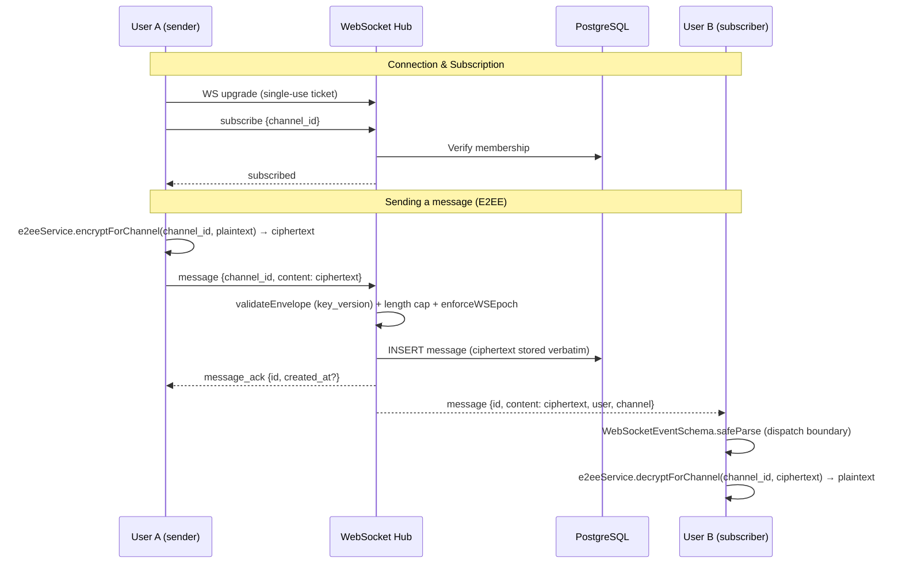
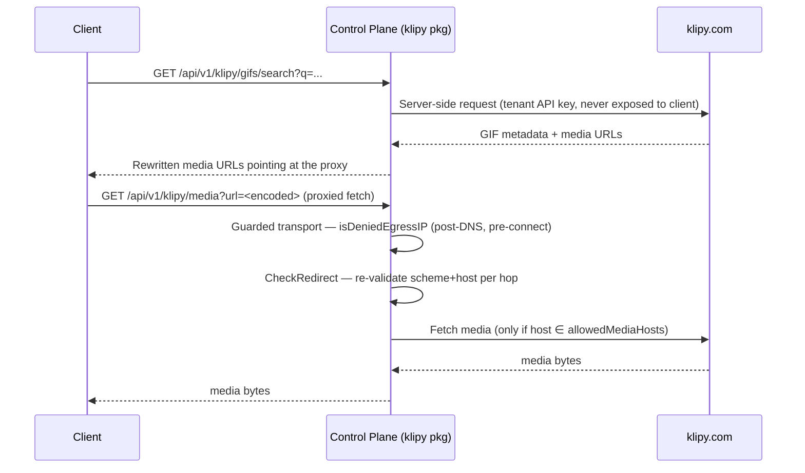
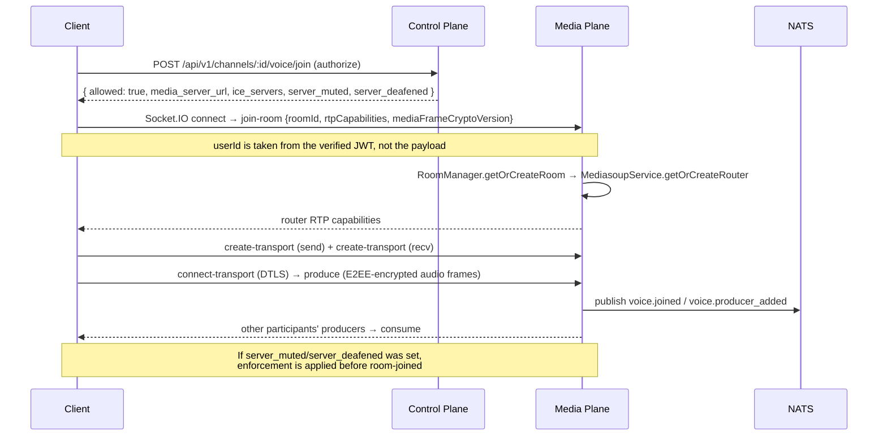
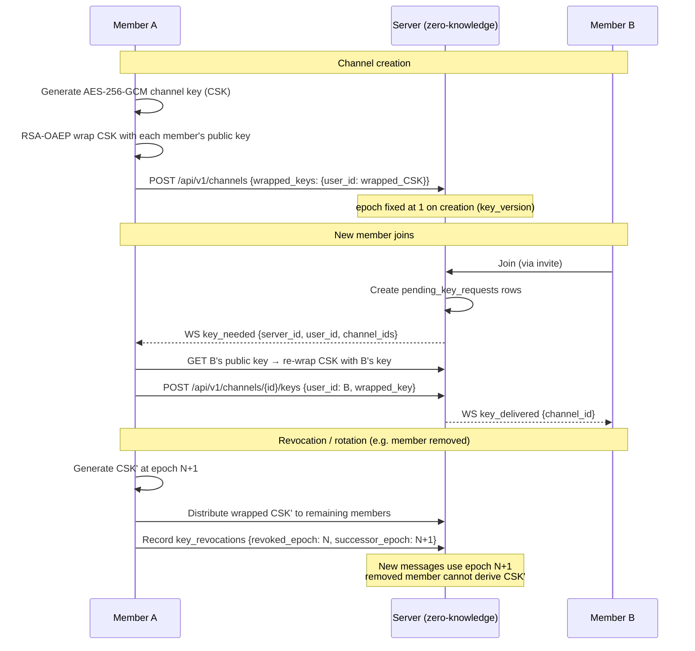
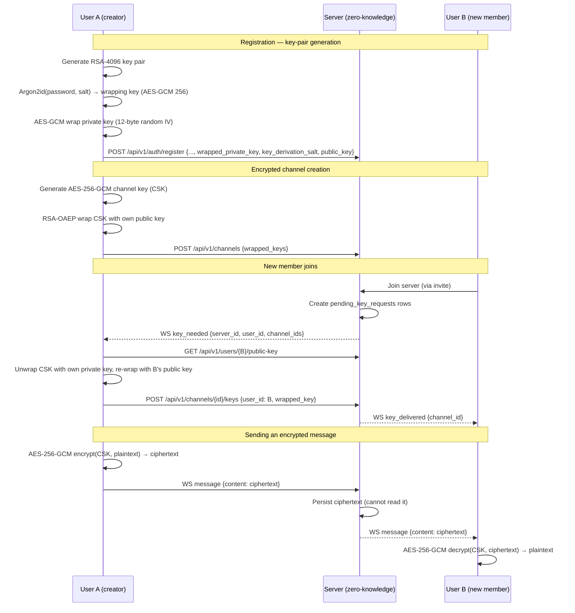

# Concord Voice Architecture

## Aggregate operations metrics

Optional operations metrics use an isolated `ops-agent` as the sole Docker
socket owner. The agent and media plane publish HMAC-signed, scalar-only v1
snapshots over fixed NATS subjects. The control plane validates and stores raw
samples for 24 hours plus hourly rollups for eight days. No user, room, server,
address, hostname, or free-form Docker metadata is persisted. Collection failure
degrades only this signal path. Account activity is reduced inside the trusted
control plane to fixed counts; only a private latest-qualification timestamp is
retained per user, and no identity enters the metrics store. The Admin Portal
reads these aggregates through
four Cloudflare- and admin-session-gated GET routes backed by a separate
two-connection PostgreSQL role that can select only the metrics tables. See
[ADR-0030](adr/0030-aggregate-operations-metrics-boundary.md).

## Admin Portal

The shipping React and TypeScript Admin Portal is a browser client served by the
control plane at `/admin/`; its assets are built from `client/admin` into the
production image, not committed as `dist`. The request and authorization path is
deliberately layered:

```text
Operator browser
  -> hosted edge gate (Cloudflare Access)
    -> control-plane /admin/*
      |-> SPA shell, assets, auth, and enrollment (no local session required)
      `-> AdminAuthRequired -> protected admin and fixed aggregate metrics APIs
```

The local session, not a user JWT, authorizes the protected administration and
metrics APIs. The portal validates closed catalog identifiers and finite scalar
values before rendering, and its JavaScript does not persist fetched samples,
counter baselines, node IDs, or health changes. Compose supplies `client/admin`
as the named `admin_ui` build context while the primary control-plane context
remains `services/control-plane`. See
[ADR-0031](adr/0031-admin-portal-frontend.md).

> **Last audited:** 2026-06-10 — counts and code references verified against `main` at this date via `scripts/update-claude-md-counts.sh` and a per-plane source sweep with adversarial claim-by-claim re-verification (issue #587). Cite file paths + symbol names rather than line numbers so this document resists drift.

## Quick Overview

> Summary for AI assistants. For detailed diagrams and schema, see the sections below.

### System Overview

Concord Voice is a distributed real-time communications platform with three service planes:

```text
┌──────────────────────────────────────────────────────────────────┐
│  Desktop Client (Electron + React + TypeScript)                  │
│  - Zustand stores, E2EE via WebCrypto, safeStorage tokens       │
└──────┬────────────────────────────────┬──────────────────────────┘
       │ HTTP/WebSocket :8080           │ Socket.IO + WebRTC :3000
       ▼                                ▼
┌──────────────────────┐    ┌─────────────────────────────────────┐
│  Control Plane (Go)  │    │  Media Plane (Node.js + mediasoup)  │
│  Gin 1.12 API        │    │  WebRTC SFU, Socket.IO signaling    │
│  Auth, RBAC, chat,   │    │  Voice/video routing, RoomManager   │
│  WebSocket hub       │    │  1 router per room, transport/user  │
└──────┬───────┬───────┘    └──────┬──────────────────────────────┘
       │       │                   │
       ▼       ▼                   ▼
┌──────────┐ ┌───────┐      ┌───────┐
│PostgreSQL│ │ Redis │      │ Redis │
│ 16       │ │ 7     │      │ 7     │
│          │ │       │      │       │
└──────────┘ └───┬───┘      └───┬───┘
                 │              │
                 └──── NATS ────┘
                   2.x (events)
```

### Service Responsibilities

#### Control Plane (Go + Gin, port 8080)

- User authentication (JWT access 15min + HttpOnly refresh 30d)
- Server/channel/member CRUD, RBAC permission enforcement
- WebSocket hub for real-time messaging and presence
- DM system (8 tables, E2EE with key-epoch enforcement)
- MFA (TOTP, WebAuthn), email verification, ownership transfer
- API route registrations across 20+ route groups; generated counts are checked by `scripts/update-claude-md-counts.sh`

#### Media Plane (Node.js + mediasoup, port 3000)

- WebRTC SFU for voice and video (Opus codec, 7 quality tiers)
- Socket.IO signaling for transport negotiation
- `RoomManager` is authoritative for produce/consume/transport lifecycle
- Frames are E2EE _above_ the SFU (see [Media E2EE](#media-e2ee-frame-encryption)); the SFU forwards opaque RTP
- NATS integration for participant state events to control plane

#### Desktop Client (Electron 43 + React 19)

- Secure IPC via preload bridge (contextIsolation ON, nodeIntegration OFF)
- E2EE: AES-256-GCM message encryption, RSA-OAEP 4096-bit key wrapping
- Token storage via Electron safeStorage (OS keychain)
- Zustand stores for state management
- Adaptive renderer load: remote SPA (Cloudflare Pages) with bundled `app://` fallback

### Data Flow

1. **Authentication:** Client → POST /auth/login (email + password) → JWT pair → access token in memory, refresh token in safeStorage
2. **Messaging:** Client → WebSocket (ticket-auth) → hub routes ciphertext to channel/DM subscribers
3. **E2EE:** Client encrypts (AES-256-GCM) → server relays ciphertext → recipient decrypts
4. **Voice:** Client → Socket.IO signaling → Media Plane (mediasoup SFU) → DTLS-SRTP transport carrying E2EE-encrypted frames → routed to other clients

### Infrastructure

- **Database:** PostgreSQL 16 (schema under `services/control-plane/migrations/`)
- **Cache:** Redis 7 for sessions, presence, RBAC cache, rate limiting (both planes connect to the same server)
- **Messaging:** NATS 2.x for inter-service events
- **CI/CD:** GitHub Actions → SonarQube Quality Gate (≥ 80% coverage)
- **Security:** 41 pre-commit hooks (across 22 repos), SAST (Semgrep), secret detection (gitleaks, TruffleHog)
- **Deployment:** Docker Compose (base + production overlay); SPA on Cloudflare Pages

### Key Design Decisions

- **Privacy-first:** E2EE by default, no server-side plaintext message storage
- **Hybrid deployment:** Same codebase for SaaS and self-hosted
- **Defense in depth:** Electron hardening + CSP + pre-commit secrets + SAST + SonarQube
- **Explicit over implicit:** All error paths handled, all state transitions visible

## Overview

Concord Voice is a distributed real-time communications platform with clear separation of concerns. Three service planes are **implemented and run in production**; a fourth is planned (see [Planned / Not Yet Implemented](#planned--not-yet-implemented)).

1. **Client Layer** — the Electron desktop application (the only shipping client).
2. **Control Plane** (Go) — auth, business logic, RBAC, messaging hub, E2EE ciphertext relay, object-storage proxy.
3. **Media Plane** (Node.js + mediasoup) — WebRTC SFU for voice/video.

The **Licensing Authority** (self-hosted license management) is a Phase-3 planned service and is **not yet built** — its directory is profile-gated out of the production stack.

## High-Level Architecture


```mermaid
flowchart TB
    subgraph Clients
        Desktop["Desktop Client<br/>Electron + React"]
    end

    subgraph Edge
        CFP["Cloudflare Pages<br/>spa.concordvoice.chat<br/>(SPA bundle)"]
        CF["Cloudflare proxy<br/>api.concordvoice.chat"]
    end

    subgraph Services
        CP["Control Plane<br/>Go + Gin :8080"]
        MP["Media Plane<br/>Node.js + mediasoup :3000"]
    end

    subgraph Infrastructure
        PG[("PostgreSQL 16<br/>55 tables")]
        RD[("Redis 7<br/>sessions / presence / RBAC")]
        NATS["NATS 2.x<br/>inter-service events"]
        OBJ[("MinIO / S3<br/>avatars, attachments")]
        TURN["coturn<br/>STUN / TURN (TLS)"]
    end

    Desktop -- "remote SPA (HTTPS)" --> CFP
    Desktop -- "app:// bundled fallback" --> Desktop
    Desktop -- "HTTP / WebSocket" --> CF --> CP
    Desktop -- "Socket.IO signaling" --> MP
    Desktop -- "WebRTC (DTLS-SRTP, E2EE frames)" --> MP
    Desktop -. "ICE via" .-> TURN

    CP --> PG
    CP --> RD
    CP --> OBJ
    CP <-- "voice.* events" --> NATS
    MP <-- "voice.* events" --> NATS
    MP --> RD
```

## Component Details

### Client Layer

#### Desktop Client (Electron + React + TypeScript)

The desktop client is the only shipping client. Source: `client/desktop/`.

- **Process layout** (`client/desktop/src/` has five top-level source dirs):
  - `main/` — Electron main process: packaged-macOS `/Applications` placement gate before `BrowserWindow` creation (`applicationsFolderGate.ts`); `BrowserWindow` creation, `app://` scheme registration, IPC dispatch, updater wiring, quit lifecycle (`main.ts`); secure token persistence (`tokenManager.ts`); adaptive renderer loading (`spaLoader.ts`); the `app://` resolver (`appProtocol.ts`); device fingerprint (`machineId.ts`); userData path pinning (`pinUserDataPath.ts`); auto-update trust chain (`updater.ts`, `updateSafety.ts`, `verifyWindowsSignature.ts`).
  - `preload/preload.ts` — the single `contextBridge` bridge exposing a minimal typed `window.electron` API.
  - `renderer/` — the React SPA: `stores/` (Zustand stores), `services/` (singletons incl. `e2eeService.ts`, `mediaEncryption.ts`, `searchService.ts`, WebSocket, API client, voice), `components/`, `hooks/`, `types/ws-events.ts` (zod WS schema).
  - `shared/` — three cross-process modules: `clientBehavior.ts` (window close/minimize routing), `spaIpcTypes.ts` (self-heal IPC contract), `spaUrlPattern.ts` (the shared SPA chunk-URL regex; the legacy `SPA_URL_PATTERN` was removed by #1657 in favor of runtime base-dir matching).
  - `constants/` — typed constants + build-time generators (e.g. `updateEndpoint.mts`), included in the Istanbul coverage set.
- **Responsibilities:** browser-inspired UI (server bar, channel panel), WebRTC media handling (Opus, 7 quality tiers), voice controls (mute/deafen/PTT, device selection, per-user volume), screen sharing, video calls, E2EE encrypt/decrypt via `e2eeService` (`encryptForChannel` / `decryptForChannel`), secure token storage via `safeStorage`. _(This list is non-exhaustive — the renderer also carries TTS (`ttsService.ts`), keyboard-shortcut customization, OS-permission management (`permissionManager.ts`, macOS screen-recording/mic TCC), and a startup splash window.)_
- **Security posture:** `contextIsolation` ON and `nodeIntegration` OFF unconditionally; no `@electron/remote`. `sandbox` (and `webSecurity`) are ON in packaged builds (`sandbox: isPackaged` in `browserWindowConfig.ts`) and off in dev/unpackaged runs. IPC handlers that reach privileged side effects validate the sender frame via `isPermittedFrameUrl` (`src/main/ipc/frameValidation.ts`).
- **Token storage:** when Remember Me is enabled, the refresh token and E2EE session keys are persisted by `tokenManager.ts` via Electron `safeStorage` (OS keychain — Keychain / DPAPI / libsecret). SaaS keeps the historical pinned-userData files (`secure-token.dat`, `secure-e2ee.dat`, `token-meta.json`, `machine-id.json`); validated self-hosted origins use `profiles/<sha256(origin)>/` with an active-profile pointer at the pinned root. Self-hosted origins are accepted only after the main-process `selfHosted:probeServer` IPC probes `/api/v1/client/config` and `/api/v1/server/capabilities`; renderer URL helpers then route API/WebSocket/media calls to the selected runtime base. When Remember Me is disabled, the refresh token **and the E2EE key material** stay in main-process memory only (`inMemoryRefreshToken` / `inMemoryE2EEKeys`) and disk token files are deleted; renderer soft reloads restore both from that process memory (so session-only content stays decryptable across a reload), but app restarts require login. The in-memory E2EE keys are wiped on `clearTokens()`/logout. On every successful session restore the renderer re-runs `hydratePostLogin()` so a session-only soft reload reloads servers/profile/preferences rather than landing authenticated-but-empty (#1870). The access token is **memory-only** (never persisted to disk); it is returned to the renderer via IPC and also cached in main-process memory (`cachedAccessToken`) for proactive refresh.
- **Auth continuation and credential ownership:** asynchronous login, MFA, verification, and SSO continuations capture both the renderer's `authGeneration` and a runtime-server selection epoch; either changing invalidates the continuation, including an A→B→A server switch. Main-process credential storage returns an opaque `CredentialOwner` that stays stable across refresh-token rotation and gates conditional token/E2EE writes or cleanup, so a stale continuation cannot overwrite or erase its successor; renderer code must not assign ordering or identity semantics to it. Direct Apple/Google SSO accepts only an exact production, current, or previously probed self-host API origin, uses one shared provider generation to reject late completions, and keeps the refresh credential in main while returning a sanitized access-token/session/owner result.
- **Refresh lineage and IPC v18 compatibility:** refresh establishes explicit S1 → S2 lineage: the control plane returns S2 as `session_id` and S1 as `previous_session_id`, and the renderer rotates only when both that lineage and its captured `authGeneration` match. A successful login/restore or clear advances the renderer generation; an accepted refresh does not. These shapes and owner-scoped channels are the load-bearing `IPC_CONTRACT_VERSION = 18` surface across main, preload, renderer, and tests; a remote SPA requiring it sets the corresponding `spaIpcContract` minimum so older shells fall back to bundled content and update.
- **E2EE initialization cleanup ownership:** after `e2eeService.initialize()` commits, an auth flow captures an `E2EEInitializationReceipt` containing the exact `sessionKeys` object and committed attempt. Its stale cleanup may call `clearKeys()` only through `clearKeysIfInitializationCurrent()`, which requires the key identity, `sessionKeysInitAttempt`, and latest-started `initAttemptSequence` to still match that receipt. This preserves both a newer committed keyset and a newer initializer that has started but not yet committed.
- **Path identity:** `pinUserDataPath.ts` pins `userData` to `<appData>/ConcordVoice` as `main.ts`'s first import, decoupling the machine path-identity from the mutable display name. The Applications-folder prompt stores version-keyed suppression in `install-preferences.json` under that pinned `userData` path.
- **Video acceleration startup:** before `app.whenReady()`, `main.ts` reads the persisted hardware-acceleration preference. Enabled requests Chromium's accelerated encoder/decode features plus `WebRtcAV1HWEncode`; disabled calls `app.disableHardwareAcceleration()`. Changing this backend preference requires a full relaunch because Chromium constructs its encoder factory at process startup. Codec/profile and HDR target changes can re-produce active publishers live. The feature flags and exact WebCodecs probes express eligibility only; active WebRTC `powerEfficientEncoder` stats remain the runtime source of truth and an explicit `false` demotes matching hardware targets for the session.
- **Communication:** HTTP/WebSocket → Control Plane; Socket.IO → Media Plane (signaling); WebRTC (DTLS-SRTP carrying E2EE frames) → Media Plane (audio/video).

#### SPA Deploy Lifecycle (ADR-0001, ADR-0015)

The SPA bundle is served by **Cloudflare Pages** at the CONSTANT URL `https://spa.concordvoice.chat/index.html`; serving is decoupled from the Go control-plane. The per-deploy SHA no longer appears in the URL; Pages publishes each deployment atomically and serves the latest at the constant host. The bundle stays decoupled from its serving origin at build time: Vite's `base: './'` makes all chunks resolve relative to the URL `index.html` was loaded from.

The deploy pipeline `wrangler pages deploy`s the renderer bundle to Cloudflare Pages, writes `spa.env` with the constant `SPA_URL` (the per-deploy SHA is recorded as the `SPA_VERSION` annotation only, never in the URL), and commits + pushes `spa.env` back to main via a short-lived, least-privilege (Contents:write) GitHub App installation token.

Five invariants enforce the contract:

1. **Build invariant** — `vite.config.ts` keeps `base: './'`. Locked by `vite-base-relative.test.ts`.
2. **Deploy invariant** — `spa.env` is a generated artifact, verified by a CI contract check. The committed `spa.env` is bind-mounted into the control-plane container as a single file, so the deploy step rsyncs it with `--inplace` (writes the existing inode rather than atomic-rename to a new one) to avoid a stale-inode `spaUrl` class of bug.
3. **Runtime safety net** — the renderer self-heals on chunk-load failures via two-layer detection (renderer-side listeners in `spaSelfHealClient.ts` + main-process `did-fail-load` in `spaSelfHeal.ts` / `spaSelfHealMainFrame.ts`) feeding a shared recovery primitive with R2 retry.
4. **Bundled fallback** — when `spaLoader.ts`'s `resolveSpaSource()` cannot validate the remote SPA (HTTPS + IPC-contract checks fail), it falls back to `mode: 'bundled'`, loading `app://concord/index.html` from the asar bundle. The `app://` scheme is registered privileged (`standard`/`secure`/`supportFetchAPI`/`corsEnabled`) in `main.ts` and resolved by `appProtocol.ts` (host check + path-traversal rejection).
5. **Freshness check** — `clientConfigService.ts` asks main's `spaUpdate.checkForUpdate()` to compare the served entry bytes at startup, every five minutes, on focus, and on visible-resume. If newer bytes are available, it applies through main's `spa:reloadLatest` soft-reload path, which re-runs `resolveSpaSource()` and uses no-cache `net.fetch` / `loadURL` options. Auto-apply is deferred while voice is connecting/connected/reconnecting, screen share is active, or a DM call is ringing/in-call.

The deploy-contract rationale and the move from the Go control-plane to Cloudflare Pages are captured in the project's architecture decision records.

#### Desktop Auto-Update Trust Model

The SPA hot-update path above is distinct from the **binary** auto-update path that ships new Electron app versions. The latter is a security-critical, signature-verified pipeline in `src/main/` (see the [update trust model](policies/update-trust-model.md)):

- **`updater.ts`** — `electron-updater` wiring with `autoDownload = false` (the download is a deliberate, user-gated step, not silent), prerelease opt-in gating, and a static public GitHub recovery feed (`releases/latest/download`). It pins the Windows publisher chain by monkey-patching `verifyUpdateCodeSignature` to require the Microsoft Trusted Signing intermediate (`updatePinning.ts` / `updatePinningConfig.ts`).
- **`verifyWindowsSignature.ts`** — independent Authenticode signature verification of the downloaded Windows installer.
- **`updateSafety.ts`** — update-safety gating (refuses unsafe transitions) before an update is applied.
- **`userDataMigration.ts`** — migrates the userData tree across versions, tied to the path-identity pinning described above.

Packaged clients fetch binary update manifests + signed installers from the public `Concord-Voice/Concord-Voice` GitHub Releases `latest/download` feed; the trust decisions (signature + cert-chain + safety) all happen client-side in the main process. API-host certificate pinning remains defense-in-depth for the API host, not the binary updater feed.

### Control Plane (Go)

**Port**: 8080 · Source: `services/control-plane/`

**Tech Stack:** Go 1.26, Gin web framework, PostgreSQL 16, Redis 7, `gorilla/websocket`. The router is assembled in `internal/api/router.go` (`NewRouter`).

**Internal packages** (`services/control-plane/internal/`; count generated by `scripts/update-claude-md-counts.sh`):

| Package         | Responsibility                                                                               |
| --------------- | -------------------------------------------------------------------------------------------- |
| `api`           | Router wiring — assembles all handlers into the Gin engine                                   |
| `attestation`   | Client attestation registry: verify, publish, revoke, cache, OIDC, prune                     |
| `auth`          | Register, login, refresh, logout, recovery flows, WS ticket issuance, SSO adapter            |
| `channels`      | Channel CRUD, key distribution, unread tracking, epoch validation                            |
| `clientconfig`  | Serves dynamic runtime config (SPA URL, media-plane URL, TURN, feature flags, minVersion)    |
| `database`      | PostgreSQL connection + migration runner                                                     |
| `dm`            | DM conversation CRUD, DM messages, DM voice calls (ring/decline/cancel), DM key distribution |
| `email`         | Email sending (verification codes, notifications) via SMTP/Resend                            |
| `friends`       | Friend requests, acceptance/decline, blocking, friend codes                                  |
| `invites`       | Server invite code generation, listing, revoking, joining, preview                           |
| `klipy`         | KLIPY GIF API + media proxy with SSRF egress guard                                           |
| `media`         | Object-store handler: avatar, banner, server-icon, attachment up/download                    |
| `members`       | Server membership: add, update role, remove, ban/unban (optional purge-on-ban/kick of the removed user's messages, #1353) |
| `messages`      | Channel + DM message CRUD, reactions, pins, embed suppression                                |
| `mfa`           | TOTP, WebAuthn, backup codes, recovery key, trusted devices, recovery circle                 |
| `middleware`    | Auth, CORS, rate-limiting, security headers, attestation gate, request-ID                    |
| `models`        | Shared Go struct types                                                                       |
| `notifications` | Notification mute preferences (per-server/channel/DM)                                        |
| `oauth`         | OAuth 2.0 / OIDC provider integrations for SSO (Google, Apple)                               |
| `opsmetrics`    | Closed-schema aggregate host, service, control, and media metrics collection and retention   |
| `ownership`     | Server ownership transfer: initiate, confirm, cancel, reverse                                |
| `presencehistory` | Opt-in self-only activity ledger, disclosure, retention, reconciliation, and admin controls |
| `privacy`       | GDPR Article 17 account-erasure endpoint                                                     |
| `rbac`          | Role-based access control: resolver, cache, middleware, audit log                            |
| `servers`       | Server CRUD, unread-status aggregation                                                       |
| `sessions`      | Session listing, per-session and all-session revocation                                      |
| `storage`       | S3-compatible (MinIO) client wrapper                                                         |
| `testhelpers`   | Integration-test utilities                                                                   |
| `updates`       | Legacy/private update manifest surface; packaged clients use the public GitHub recovery feed |
| `users`         | User profile, keys, password, SSO identities, search, account deletion, E2EE blob sync       |
| `voice`         | Voice channel join authorization, participants, server-mute/deafen, NATS subscriber          |
| `websocket`     | WS hub, client pump, message dispatch, broadcast routing                                     |

**Responsibilities:** authentication; server/channel CRUD; membership + RBAC; user presence; opt-in self-only Activity History; WebSocket signaling and message relay; E2EE ciphertext relay (the server never decrypts); MFA; SSO; account erasure; object storage; client attestation; rate limiting.

**API:** REST handlers + the single `/ws` upgrade endpoint across 20+ route groups (`/auth`, `/auth/sso`, `/mfa`, `/users`, `/sessions`, `/servers`, `/channels`, `/categories`, `/e2ee`, `/messages`, `/dm/conversations`, `/friends`, `/invites`, `/voice`, `/media`, `/notifications`, `/privacy`, `/klipy`, `/updates`, `/ws`). The authenticated `/users/me/presence-history` and `/users/me/presence-history/settings` operations contain no target-user identifier and expose only the caller's settings and history. The Klipy routes register only when `KLIPY_API_KEY` is set; some media routes register a 503 fallback when object storage is unconfigured. See [API Documentation](./api/README.md); generated route counts are checked by `scripts/update-claude-md-counts.sh`.

**E2EE relay (zero-knowledge):** the server relays ciphertext and never decrypts. On the REST path, `messages` handlers (`internal/messages/handlers.go`) validate ciphertext structurally (`isValidCiphertext` — base64 + ≥28-byte decoded length) and enforce epoch revocation (`enforceE2EE`). Channel and DM edits require a positive `key_version`; channel edits require the author to retain `PermManageOwnMessages`, while DM edits require participant and author checks. Their handlers then validate the ciphertext and epoch and store `content` and `key_version` atomically.

Migration 000085 serializes edits against revocation inserts on the stable channel
or conversation row: the revocation trigger takes `FOR SHARE`, while the edit
transaction takes `FOR NO KEY UPDATE` before a fresh ledger check and conditional
update. Group-DM membership and deletion transactions follow the same parent-first
lock order: add/remove take `FOR NO KEY UPDATE` on `dm_conversations` before touching
`dm_participants`, while group deletion takes `FOR UPDATE` before deleting children.
Taking a participant-row or foreign-key lock first can deadlock when PostgreSQL later
upgrades the parent lock, so new child-table mutations must preserve this order.

On the WebSocket path, the hub validates the envelope (`validateEnvelope` — `key_version` present, length cap) and enforces epochs (`enforceWSEpoch` in `internal/websocket/hub.go`); it stores the `content` column verbatim. The E2EE-everywhere posture (#201) removed all per-row `is_encrypted` flags (migration 000062) — encryption is structural, not a runtime branch.

**Outbound SSRF egress guard:** the Klipy media proxy (`internal/klipy/handlers.go`) is the reference SSRF-hardened outbound surface. A cloned transport installs `net.Dialer.Control` running `isDeniedEgressIP` (post-DNS, pre-connect — defends redirect-SSRF + DNS-rebinding with no TOCTOU window; denies loopback / private / ULA / link-local / multicast / CGNAT / deprecated site-local, after `Unmap()`), and `http.Client.CheckRedirect` re-validates scheme + host against `allowedMediaHosts` on every hop.

**WebSocket hub** (`internal/websocket/hub.go`): a single `Run()` goroutine owns the subscription maps (`clients`, `userClients`, `channelSubscriptions`, `serverSubscriptions`, `dmSubscriptions`) and drains buffered broadcast channels. `handleIncoming` dispatches inbound frames by `type` (subscribe, message, typing, presence, DM variants, …); outbound fan-out is `BroadcastToChannel` / `BroadcastToServer` / `BroadcastToUser` / `BroadcastToDM` / `BroadcastToAll`.

#### Database Schema

PostgreSQL 16 (schema under `services/control-plane/migrations/`). Under E2EE-everywhere (#201) the `is_encrypted` columns were dropped (migration 000062) from `channels`, `messages`, `dm_conversations`, `dm_messages`, and `media_files` — they are intentionally absent below.

**Identity, auth, RBAC & server structure:**


```mermaid
erDiagram
    users ||--o| user_keys : "has"
    users ||--o{ public_keys : "has"
    users ||--o{ refresh_tokens : "has"
    users ||--o| user_mfa_totp : "has"
    users ||--o{ user_mfa_webauthn : "has"
    users ||--o| user_recovery_keys : "has"
    users ||--o{ user_sso_identities : "links"
    users ||--o{ server_members : "joins"
    servers ||--o{ channels : "contains"
    servers ||--o{ server_members : "has"
    servers ||--o{ channel_groups : "organizes"
    servers ||--o{ roles : "defines"
    servers ||--o{ server_bans : "enforces"
    servers ||--o{ audit_log : "records"
    servers }o--|| users : "owned by"
    roles ||--o{ member_roles : "assigned via"
    server_members ||--o{ member_roles : "carries"
    channels ||--o{ channel_permission_overrides : "scopes"
    channel_groups ||--o{ category_permission_overrides : "scopes"

    users {
        UUID id PK
        VARCHAR email UK
        VARCHAR username UK
        TEXT password_hash
        VARCHAR display_name
    }
    user_keys {
        UUID user_id PK, FK
        BYTEA wrapped_private_key
        BYTEA key_derivation_salt
        INTEGER key_version
    }
    refresh_tokens {
        UUID id PK
        UUID user_id FK
        TEXT token_hash UK
        TIMESTAMPTZ expires_at
        TIMESTAMPTZ revoked_at
    }
    servers {
        UUID id PK
        VARCHAR name
        UUID owner_id FK
    }
    channels {
        UUID id PK
        UUID server_id FK
        VARCHAR type
        UUID linked_voice_channel_id FK
    }
    server_members {
        UUID server_id PK, FK
        UUID user_id PK, FK
    }
    roles {
        UUID id PK
        UUID server_id FK
        VARCHAR name
        BIGINT permissions "bitfield"
    }
    member_roles {
        UUID role_id FK
        UUID server_id FK
        UUID user_id FK
    }
```

**Messaging & DM system (the 8-table DM core plus later message extensions):**


```mermaid
erDiagram
    channels ||--o{ messages : "contains"
    channels ||--o{ channel_read_states : "tracks"
    messages ||--o{ message_reactions : "has"
    messages ||--o{ message_attachments : "carries"
    messages |o--o| messages : "reply_to"
    users ||--o{ friendships : "requests"
    users ||--o{ dm_conversations : "creates"
    dm_conversations ||--o{ dm_participants : "has"
    dm_conversations ||--o{ dm_messages : "contains"
    dm_conversations ||--o{ dm_read_states : "tracks"
    dm_messages ||--o{ dm_message_attachments : "carries"
    dm_messages ||--o{ dm_message_reactions : "has"
    media_files ||--o{ message_attachments : "stored as"
    media_files ||--o{ dm_message_attachments : "stored as"

    messages {
        UUID id PK
        UUID channel_id FK
        UUID user_id FK
        TEXT content "ciphertext"
        UUID reply_to_id FK
        UUID pinned_by FK
        TIMESTAMPTZ edited_at
    }
    dm_conversations {
        UUID id PK
        BOOLEAN is_group
        VARCHAR name
        TEXT icon_url
        UUID created_by FK
    }
    dm_participants {
        UUID conversation_id PK, FK
        UUID user_id PK, FK
        VARCHAR role "admin or member"
    }
    dm_messages {
        UUID id PK
        UUID conversation_id FK
        UUID user_id FK
        TEXT content "ciphertext"
        VARCHAR type "incl. call_event"
        UUID pinned_by FK
        JSONB call_event_payload
    }
    message_reactions {
        UUID message_id FK
        UUID user_id FK
    }
    dm_message_reactions {
        UUID message_id FK
        UUID user_id FK
        VARCHAR emoji
    }
    media_files {
        UUID id PK
        SMALLINT media_tier "1=server-readable, 2=E2EE"
    }
```

**E2EE key material (epoch-tracked; server channels and DMs are parallel):**


```mermaid
erDiagram
    users ||--o{ public_keys : "publishes"
    channels ||--o{ channel_keys : "wrapped per-member"
    channels ||--o{ pending_key_requests : "awaiting distribution"
    channels ||--o{ key_revocations : "epoch ledger"
    dm_conversations ||--o{ dm_channel_keys : "wrapped per-member"
    dm_conversations ||--o{ dm_pending_key_requests : "awaiting distribution"
    dm_conversations ||--o{ dm_key_revocations : "epoch ledger"

    channel_keys {
        UUID id PK
        UUID channel_id FK
        UUID user_id FK
        TEXT wrapped_key
        INTEGER key_version "epoch"
    }
    key_revocations {
        UUID id PK
        UUID channel_id FK
        INTEGER revoked_epoch
        INTEGER successor_epoch
    }
    dm_channel_keys {
        UUID id PK
        UUID conversation_id FK
        UUID user_id FK
        TEXT wrapped_key
        INTEGER key_version "epoch"
    }
    dm_key_revocations {
        UUID id PK
        UUID conversation_id FK
        INTEGER revoked_epoch
        INTEGER successor_epoch
    }
```

**Supporting tables** (covered for completeness; most carry a simple `user_id → users` FK):

| Domain               | Tables (creating migration)                                                                                                                                                                                                                                                                                   |
| -------------------- | ------------------------------------------------------------------------------------------------------------------------------------------------------------------------------------------------------------------------------------------------------------------------------------------------------------- |
| Auth / registration  | `pending_registrations` (000058)                                                                                                                                                                                                                                                                              |
| MFA / recovery       | `user_mfa_totp`, `user_mfa_webauthn` (000029); `user_recovery_keys` (000043); `trusted_recovery_devices`, `recovery_requests` (000044); `recovery_circles`, `recovery_circle_shares`, `recovery_circle_requests`, `recovery_circle_responses` (000045)                                                        |
| Profile / prefs      | `user_preferences` (000016); `privacy_settings` (000027); `username_history` (000046); `saved_gifs` (000055); `notification_preferences` (000063, polymorphic target); `user_presence_settings` (000074, eight Activity History fields added by 000087 and five category controls by 000089); `friend_organization` (000075); `presence_override_preferences`, `user_presence_overrides` (000084); `presence_settings_pending_operations` (000087); `activity_settings_pending_cleanups` (000098, durable Rich Presence policy-cleanup evidence) |
| Activity history    | `presence_history` (000087, category-neutral self-owned interval ledger)                                                                                                                                                                                                                                     |
| Voice                | `voice_participants` (000020); `dm_voice_participants` (000026); both gain authoritative `lifecycle_event_at` watermarks in 000093                                                                                                                                                                              |
| Media                | `media_files` (000042)                                                                                                                                                                                                                                                                                        |
| Social / server-mgmt | `friend_codes` (000027); `server_invites` (000009); `ownership_transfers` (000047)                                                                                                                                                                                                                            |
| Compliance           | `audit_log` (000035); `account_deletions` (000059)                                                                                                                                                                                                                                                            |
| Attestation          | `release_binaries`, `release_spas` (000066)                                                                                                                                                                                                                                                                   |
| Admin console        | `admin_users`, `admin_webauthn_credentials`, `admin_audit_log` (000077) — sessions are Redis-backed (opaque sids), not a table                                                                                                                                                                                |
| Operations metrics   | `ops_metric_samples`, `ops_metric_rollups` (000086) — opaque node ID, fixed key, timestamp, and scalar values only; `users.ops_last_active_at` private activity marker cleared beyond the 30-day window and catalog expansion (000091); restricted reader role (000088)                                                   |

> Notable schema history: group-DM admin roles added `dm_participants.role` (`admin`/`member`) + `dm_conversations.icon_url` (000053); `dm_messages` gained a `call_event` type + `call_event_payload` JSONB (000064), and the transient `kind` column was dropped in favor of `type` (000065); `account_deletions.sentry_delete_attempted` was dropped (000060) when Sentry was removed; `key_revocations.revoked_by` was changed to `ON DELETE SET NULL` (000059) so account erasure isn't blocked; migrations 000093–000097 added, backfilled, validated, and enforced microsecond lifecycle watermarks on both active voice-participant tables; migration 000098 added one privacy-critical pending Rich Presence settings-cleanup marker per user.

#### Admin auth surface (#1688)

The admin console is a **separate identity domain** — it never shares state with end-user auth (no JWT, no `users` table, no refresh tokens).

**Identity:** `admin_users` table (separate from `users`). The first admin is
created with the `control-plane admin bootstrap` CLI subcommand inside the
running container. An authenticated `POST /admin/api/v1/admins` creates each
subsequent pending admin and returns its enrollment token once; the current
Admin Portal does not expose that operation in its UI.

**Auth flow (2FA mandatory):**

1. `POST /admin/api/v1/auth/password` — constant-time password verify; returns a short-lived challenge handle + WebAuthn `BeginLogin` assertion. **Password alone never yields a session.**
2. `POST /admin/api/v1/auth/webauthn` — `FinishLogin` with `userVerification: required`; on success mints an opaque Redis session.

**Sessions:** 256-bit CSPRNG session id stored in Redis under `admin_session:{sid}`. Cookie `__Host-cv_admin_sid`: `Secure; HttpOnly; SameSite=Strict; Path=/`. Idle TTL 30 min (sliding); absolute cap 8 h. Logout `DEL`s the key (instant revocation). `AdminAuthRequired` validates the cookie → Redis → expiry only for protected administration and metrics routes. The SPA shell, assets, authentication, logout, and enrollment routes remain outside the local-session gate.

**Hardware key requirement:** `attestation: direct` is enforced at enrollment; the AAGUID is checked against `ADMIN_WEBAUTHN_ALLOWED_AAGUIDS` (canonical YubiKey 5-series set). Only approved hardware keys can become admin credentials.

**Lockout:** per-account + per-IP exponential backoff in Redis (IP is **hashed**, not stored raw) after 5 consecutive failures.

**Audit log:** `admin_audit_log` table — append-only, records every auth outcome and admin action with a sanitized actor identifier and opaque source reference. Never records passwords, assertion bytes, raw IPs, or end-user PII.

**Dormancy:** the entire surface is gated by `ADMIN_CONSOLE_ENABLED` (default `false`). All `/admin/*` routes return 404 when disabled. See the "Post-deploy: bootstrap the first admin (#1688)" section in the deploy runbook for provisioning.

**Hosted edge-gating:** hosted admin traffic is wrapped by Cloudflare Access (identity allowlist + hardware-key requirement) before origin, then nginx serves the codename vhost with a Cloudflare Origin Certificate, and the Go `/admin` route group verifies `Cf-Access-Jwt-Assertion` against the Access JWKS/audience before any admin handler runs. The origin firewall helper restricts `:443` to Cloudflare IP ranges. The codename hostname is not the access control. Protected administration and metrics requests pass both Cloudflare Access and local admin-session gates; the SPA shell, auth, and enrollment routes pass the hosted outer gate without requiring a local session.

**Read-only metrics API:** `GET /admin/api/v1/health`, `/metrics/current`,
`/metrics/series`, and `/counters` run behind both gates above. They expose only
fixed catalog metadata and scalar aggregates for the configured local node.
Current/health freshness is two collection intervals; series are UTC hourly
`24h` or `7d` windows capped at 25 or 169 buckets. Unknown parameters and
mutating methods on these paths are rejected, and each path is limited to 60
requests/minute/IP. That limiter fails closed with the same fixed
`metrics_unavailable` 503 if Redis cannot evaluate the request. All admin
responses are `private, no-store`. The handler uses a separate
maximum-two-connection pool as the database-scoped role
`concord_ops_metrics_reader_<md5(current_database())>`. Migration `000088`
ownership-marks that role and grants `SELECT` only on the two operations-metrics
tables; an unmarked name collision or any membership/effective privilege drift
fails closed. Its 256-bit password exists only in process memory. Startup first
commits `NOLOGIN PASSWORD NULL` and drains every cluster-wide session left by a
prior process, then activates a replacement credential only after router
construction succeeds. Shutdown repeats the revoke-and-drain sequence. If
collection is disabled the routes return the fixed 503; active-mode reader setup
failure stops startup instead of falling back to the application pool. An absent
or already-`NOLOGIN` role requires no privileged role change, while a
login-enabled role must be revoked successfully or startup fails closed.

**Config env vars** (all `vars.*`, non-secret): `ADMIN_CONSOLE_ENABLED`, `ADMIN_WEBAUTHN_RP_ID`, `ADMIN_WEBAUTHN_RP_ORIGINS`, `ADMIN_WEBAUTHN_ALLOWED_AAGUIDS`, `CF_ACCESS_AUD`, `CF_ACCESS_TEAM_DOMAIN`.

### Media Plane (Node.js + mediasoup) ✅ Implemented

**Port**: 3000 · **RTC ports**: 40000–40099/UDP (dev), 40000–41999/UDP (production) · Source: `services/media-plane/`

**Tech Stack:** Node.js 24, mediasoup 3.21, Socket.IO 4.8, NATS 2.x, `redis` (node-redis) client 6.x connecting to the shared Redis 7 server. The builder stage uses a custom GHCR base image (`ghcr.io/concord-voice/node-buildtools`, digest-pinned) that pre-bakes the mediasoup native-compile toolchain.

**Responsibilities:** WebRTC media routing (SFU — no mixing/transcoding); Opus audio with 7 quality tiers; per-room router management; transport/producer/consumer lifecycle; server-mute/deafen enforcement; NATS event publishing. The SFU forwards opaque, E2EE-encrypted RTP frames (see [Media E2EE](#media-e2ee-frame-encryption)).

**Component split (authoritative vs. infrastructure):**

- `MediasoupService` (`src/lib/mediasoup.ts`) owns **workers and routers only** — `init()` creates the worker pool, `getOrCreateRouter(roomId)` / `removeRouter(roomId)` manage one router per room. It holds no participant state.
- `RoomManager` (`src/lib/roomManager.ts`) is **authoritative for everything else** — `joinRoom` / `leaveRoom`, `createTransport`, `connectTransport`, `closeRecvTransport`, `produce` / `consume`, producer/consumer pause/resume/close, and the server-mute/deafen methods. `MediasoupService` is injected as a dependency. The `Room` struct carries `{ id, router, audioLevelObserver, participants, createdAt, e2eeEpoch, mediaFrameCryptoVersion }` — **no `isEncrypted` field**.

**Transport encryption is structurally mandatory.** All transports are created via `router.createWebRtcTransport` (DTLS-SRTP by construction); there is no `createPlainRtpTransport` path and no per-room encryption flag anywhere in `src/`. The `e2eeEpoch` counter increments on every authoritative participant join/leave to synchronize the media keyId ratchet; a DM A1 candidate remains provisional, and only successful A2 promotion advances the epoch. Channel-key rotation/re-wrap, not this counter, is the membership access boundary.

**Origin gate.** The Socket.IO `cors.origin` callback (`src/lib/originGate.ts`) maintains semantic parity with the control-plane CORS middleware: no-Origin → allow; `'null'` / `'file://'` → reject (case-insensitive, whitespace-tolerant); allowlist or `'*'` → allow; else reject. A production guard in `src/config/index.ts` fatal-exits if `ALLOWED_ORIGINS` contains `'*'` while `ENVIRONMENT=production` (CWE-942).

**Socket.IO events:** `join-room`, `update-rtp-capabilities`, `create-transport`, `connect-transport`, `produce`, `consume`, `request-keyframe`, `set-preferred-layers`, `update-test-status`, `pause-producer` / `resume-producer`, `close-producer`, `pause-consumer` / `resume-consumer` / `close-consumer` / `close-recv-transport`, `leave-room`; room broadcasts include `participant-testing-changed` and `camera-layering-gate`; `screen-layering-gate` is targeted only to the sharer. `join-room` carries `mediaFrameCryptoVersion`; an empty channel room seeds from its first accepted joiner, while an empty DM seeds only when an A2-approved candidate is promoted. Every later authoritative join must exactly match the occupied room. Both higher and lower mismatches receive the same typed `CryptoVersionMismatchError`; the server never ratchets a live room underneath existing peers. `join-room` participant summaries carry `isTesting` so clients can render in-call device tests. The peer-facing `user-joined` event carries identity, epoch, and optional authoritative `isDeafened` / `isTesting` values; desktop merges only present booleans so a no-leave reconnect clears stale flags without clobbering legacy or consume-race media state. `request-keyframe` lets a receiver ask the SFU to request a fresh video keyframe from a target sender after E2EE epoch recovery; the media plane validates room membership and applies a 5s per-sender cooldown before calling mediasoup `consumer.requestKeyFrame()` (PLI/FIR). `set-preferred-layers` carries receiver render demand for owned camera or screen video consumers (`consumerId`, desired layers, visibility, CSS size, device pixel ratio, role/focus/pressure flags); the media plane verifies ownership, video kind, and server-set source, applies the camera entitlement cap only to camera demand, and calls mediasoup `consumer.setPreferredLayers()` only for simulcast/SVC consumers. Camera demand drives the room camera gate, non-SVC screen demand drives the per-sharer screen gate, and SVC screen demand is applied without being stored as gate state. The `resume-producer` / `resume-consumer` handlers enforce `server_muted` / `server_deafened`. (Voice quality tiers are applied client-side via producer `codecOptions`, not a Socket.IO event.)
`close-recv-transport` validates a non-empty transport ID, derives ownership from authenticated socket state, and closes only the caller's mapped receive transport; retries and non-owned IDs are acknowledged without revealing resource existence.

#### Media E2EE (frame encryption)

Voice and **video frames are end-to-end encrypted above the SFU** — the media plane never sees plaintext media. This is a separate layer from transport DTLS-SRTP (which terminates _at_ the SFU). Implementation: `client/desktop/src/renderer/services/mediaEncryption.ts` (+ `voiceE2eeTransforms.ts`):

- **Cipher/transform path:** per-frame **AES-256-GCM** runs before frames leave the sender. Every outbound producer attaches encryption synchronously through mediasoup-client's `onRtpSender` callback, before offer creation and server-side producer signaling; setup failure aborts publish and cleans up the owning source. `encodedTransformSupport.ts` prefers `RTCRtpScriptTransform` (Web Worker) whenever present and falls back to `createEncodedStreams` (main thread) only when the Worker API is absent. The mediasoup-client `encodedInsertableStreams` transport option is set only for that legacy fallback; neither transform API means media initialization fails closed.
- **Frame keys:** derived `HKDF-SHA256(channelCSK, salt="concord-voice-e2ee", info=senderUserId)` from the **same channel CSK** used for text messages — so media encryption shares the `channel_keys` / `key_revocations` epoch ledger and rotates on member join/leave (with a short overlap window), and ratchets via `HKDF(oldKey, "concord-e2ee-ratchet")`.
- **Frame-format admission (v5):** the desktop advertises `MEDIA_E2EE_FRAME_CRYPTO_VERSION = 5`; the media plane advertises `SUPPORTED_MEDIA_FRAME_CRYPTO_VERSION = 5` and accepts rollout versions `{3, 4, 5}`. Validation runs before authoritative participant storage, reconnect cleanup, or room-epoch mutation. The first accepted channel joiner seeds an empty channel room; an empty DM is seeded only by successful A2 promotion. An occupied room admits only the exact same version. Either mismatch direction returns the same actionable `CryptoVersionMismatchError`, so incompatible active peers never coexist and the server never performs a mid-call format ratchet.
- **Codec-aware framing and fail-closed receive:** AV1 encrypts eligible OBU payloads behind a 22-byte mini-header while leaving parseable OBU structure clear. H.264 preserves its Annex-B prefix through the first VCL NAL header and three Exp-Golomb slice fields, authenticates that parser prefix as AAD, and encrypts/stuffs the remaining access-unit suffix once so ciphertext cannot create false start codes. VP9/VP8/Opus use a 22-byte whole-frame v5 trailer: `[headerBytes:1][keyId:2 BE][keyVersion:4 BE][IV:12][version:1 (=5)][magic:2]`. Whole-frame and AV1 use no AAD; H.264's parser-visible slice prefix is the deliberate exception. All non-empty malformed, unauthenticated, unsupported, missing-key, or wrong-version frames are dropped. If a decrypt transform cannot attach, `voiceService` closes the consumer before store routing or server resume.
- **Video keyframe recovery:** when the receiver detects a missing or stale media decrypt key, `voiceService` pre-installs target-epoch decrypt keys for active participants, catches the worker up to the server epoch, and emits `request-keyframe { senderUserId }` for the affected video sender. The media plane validates requester/sender membership, finds the matching video consumers, and calls mediasoup `consumer.requestKeyFrame()` under the 5s per-sender cooldown.
- **Media plane is blind by design:** no frame-crypto code exists in `services/media-plane/src/`; the SFU forwards opaque encrypted RTP payloads.

**Proposed native outbound media path.** Hard control over capture pixel format, AV1 10-bit/HDR,
and NVENC selection cannot be added by piping WebCodecs chunks into `RTCRtpSender`; that browser
API does not exist. The proposed Windows-first path is a signed C++ screen-share sidecar using
WGC/D3D11, an injected libwebrtc encoder factory, Concord v5 frame encryption, and
libmediasoupclient. libwebrtc continues to own RTP/RTCP, congestion control, ICE/DTLS/SRTP, and
mediasoup interoperability. This remains a proposed, feature-flagged POC—not a current runtime
component.

## Data Flow Examples

### User Authentication


```mermaid
sequenceDiagram
    participant C as Client
    participant CP as Control Plane
    participant PG as PostgreSQL

    C->>CP: POST /api/v1/auth/login {email, password}
    CP->>PG: Look up user by email
    PG-->>CP: User record (password_hash)
    CP->>CP: Verify password (Argon2id)
    CP->>PG: Create refresh_token row (30d)
    CP-->>C: 200 {access_token (15min), user} + Set-Cookie: refresh_token (HttpOnly)
    Note over C,CP: MFA-enabled accounts get an interstitial challenge<br/>(Redis-stashed remember_me) before tokens issue.<br/>For WebSocket: client then requests a single-use<br/>ws-ticket (30s TTL, consumed on first use).
```

### Channel Message Flow (with client-side validation)


```mermaid
sequenceDiagram
    participant A as User A (sender)
    participant WS as WebSocket Hub
    participant PG as PostgreSQL
    participant B as User B (subscriber)

    Note over A,B: Connection & Subscription
    A->>WS: WS upgrade (single-use ticket)
    A->>WS: subscribe {channel_id}
    WS->>PG: Verify membership
    WS-->>A: subscribed

    Note over A,B: Sending a message (E2EE)
    A->>A: e2eeService.encryptForChannel(channel_id, plaintext) → ciphertext
    A->>WS: message {channel_id, content: ciphertext}
    WS->>WS: validateEnvelope (key_version) + length cap + enforceWSEpoch
    WS->>PG: INSERT message (ciphertext stored verbatim)
    WS-->>A: message_ack {id, created_at?}
    WS-->>B: message {id, content: ciphertext, user, channel}
    B->>B: WebSocketEventSchema.safeParse (dispatch boundary)
    B->>B: e2eeService.decryptForChannel(channel_id, ciphertext) → plaintext
```

> **Client-side dispatch validation (PR #1184, closes #709).** Every inbound envelope is validated by `WebSocketEventSchema` (a zod 4 discriminated union over `type`) before any per-handler dispatch in `client/desktop/src/renderer/services/websocketService.ts`. Failed envelopes are dropped with a PII-scrubbed structural log (`scrubZodIssues`) and `connectionStore.wireViolationCount` is incremented. Handlers in `useWebSocketMessages.ts` operate on already-narrowed payloads. The `isInitialized` guard on `e2eeService` makes decryption fail-closed (render-as-error) if keys aren't ready, never leaking ciphertext.

Edited channel and DM content is encrypted with `encryptForChannelWithVersion`, which returns the ciphertext and the exact epoch selected before asynchronous WebCrypto work yields. The renderer sends that pair to the REST edit endpoint. A `409 epoch_revoked` response invalidates the cached channel key and permits one re-encryption attempt; missing, zero, or repeatedly revoked epochs fail closed. Incoming add and edit events share one per-message operation lane: a blank placeholder exists before add decryption, only the newest live operation may update the store/search index or emit notifications, and delete/unmount/account teardown suppresses stale continuations.

Initial and paginated history fetches bind decryption and publication to a request-local E2EE guard plus a message-invalidation journal. Reconciliation preserves newer live edits, live arrivals, and optimistic rows while refusing to restore deleted rows; an equal-timestamp loaded row remains present until the authoritative fetch replaces its content. During an initial-history request, an edit or delete for a fetched-but-unloaded ID forces one fresh request; unrelated invalidations do not. During pagination, the same conflict retries the cursor once and leaves it retryable after a second conflict without publishing a partial page. Ordinary key rotation retries/refetches and access revocation is terminal. Pinned-message batches and DM preview decrypts also assert a current channel-operation guard immediately before publication; previews additionally verify that their conversation and ciphertext still match.

### Message Search (client-side, E2EE-native)

Because the server holds only ciphertext, full-text **message search runs entirely in the renderer**. `searchService.ts` builds an in-memory MiniSearch index over _decrypted_ message content — no plaintext is written to disk or sent to the server. The client backfills the index by pulling ciphertext from a rate-limited bulk-fetch endpoint and decrypting locally; the index is memory-only, capped at ~50K messages / ~3MB with per-channel LRU eviction. Live content is indexed only after the current decrypt operation successfully updates an existing store row. Message deletion records its UUID for active backfill generations, preventing an in-flight decrypt from re-indexing or surfacing deleted plaintext; that auxiliary tracking is bounded, and overflow invalidates the affected backfill fail closed, while an ID-level signal removes plaintext already emitted into an open search result. Removing a channel or DM conversation invalidates its E2EE generation before purging that search scope; graceful account reset fences prior E2EE continuations before clearing the entire decrypted index. (User-search and Klipy GIF-search, by contrast, are server-side.)

### Encrypted Cross-Device Sync

User **preferences**, **saved GIFs**, and **friend organization** sync across devices as opaque E2EE blobs — the server stores ciphertext here too, not just for messages. The control-plane `users` package exposes encrypted-blob surfaces (`GET`/`PUT /api/v1/users/me/preferences`, `/me/saved-gifs`, and `/me/friend-organization`) storing an `encrypted_data` column with a monotonically increasing sync version and a metadata-only WebSocket broadcast on change. The standalone PUTs are last-writer-wins sync pushes; their version tells clients when to refetch. The version becomes a compare-and-swap precondition inside the password-change transaction (#2200): an ordinary password change submits every domain's authoritative populated/absent state (`expected_version`; absence asserts at version zero without creating a row) pre-encrypted with the new preferences key, and the control plane locks the domain rows in migration-age order (`users` → `user_preferences` → `saved_gifs` → `friend_organization` → `presence_override_preferences`) and rotates them in the same transaction as the password, key material, and refresh-token revocation — any domain conflict rolls the whole change back. The client encrypts/decrypts via `e2eeService` through `e2eeBlobTransport.ts` (`preferencesSync.ts`, `savedGifsSync.ts`, and `friendOrgSync.ts`). Friend-category names, colors, and membership groupings therefore remain invisible to the server.

Post-login sync is bound to one authenticated renderer lifecycle. Password, MFA, WebAuthn, and restored sessions start hydration after E2EE is ready; SSO deliberately defers the same encrypted hydration chain until `SSOEagerUnlock` initializes E2EE and App reruns it. A shared generation guard and `AbortSignal` directly cover preferences, saved GIFs, notification preferences, and entitlement hydration. Friend organization and presence exceptions use service-local generations/controllers, and the shared hydration chain verifies their current-generation result before continuing. Logout or account switching invalidates the shared guard before stopping each service and invalidating its local work, so a prior account's delayed decrypt, bootstrap push, entitlement response, or notification sweep cannot mutate state or issue a write with the next account's credentials.

### Rich Presence Settings

Migration 000089 additively extends the `user_presence_settings` table created
by 000074. `master_enabled` defaults to true and is the global disclosure gate;
false suppresses every category, including Private Call participants, without
erasing saved values. `server_voice_tier` defaults to 1 (Friends in the active
server) and `server_voice_show_details` defaults to true. `private_call_tier`
defaults to 0 (call participants only while the master gate is enabled) and
`private_call_show_details` defaults to false. Both tiers accept 0..2. The four
category-specific fields are policy inputs for #2231's authoritative Server
Voice and Private Call production, minimized live delivery, and freshly
authorized reconnect projection. The shipped Custom Status path also consumes
`master_enabled` as its global gate. Migration 000089 itself adds no table,
index, trigger, or speculative category columns.

Server Voice and Private Call live WebSocket frames are enabled per device only
when the authenticated `/api/v1/ws` upgrade has exactly one
`activity_rich_presence=1` query value. The handler records the immutable flag
before Hub registration and reconnect bootstrap; missing, malformed, or
duplicate values fail closed. This preserves mixed-version sessions because
released clients can accept an activity clear while misapplying it to Custom
Status. The #2231 desktop advertises the value after adding category-specific
live-update validation, but its handlers deliberately ignore Server Voice and
Private Call updates/clears and its snapshot schema strips activity fields.
Issue #2233 owns category state, snapshot replacement, resets, and rendering. Reconnect
snapshot fields remain safe for legacy clients, whose schema strips them, and a capable client receives
the snapshot before its buffered live tail because its capability is known
before bootstrap starts.

Migration 000098 adds `activity_settings_pending_cleanups`, one durable marker
per user containing the exact versioned before/after policy bracket committed
with a real activity-policy change. Successful suppression atomically replaces
that bracket with a durable receipt; finalization deletes the receipt in a new
transaction, so an ambiguous commit or retry cannot replay external suppression.
Policy writers serialize on the canonical
user/settings rows and recheck the marker in that transaction; cleanup
resumptions hold a deterministic per-user advisory transaction lock around the
marker row and suppression. A writer that waited behind a committed writer
therefore sees its marker and routes through advisory-serialized resume. A
confirmed commit whose exact suppression or affected-recipient disconnect fails
returns 503 and keeps the marker; a same-value retry resumes that original
obligation before applying another policy write. A retry that finds a suppression
receipt skips suppression and only finalizes the exact operation; successor
operation IDs fail closed. The destructive down migration takes an `ACCESS
EXCLUSIVE` table lock before checking emptiness and refuses to drop pending
privacy-repair evidence.

### Custom Status Recipient Exceptions

Custom Status combines a server-readable presence payload with a zero-knowledge organization preference and server-enforced recipient exclusions. `PUT /api/v1/users/me/presence-overrides/custom_text` performs one compare-and-swap transaction: `presence_override_preferences` stores the opaque client-encrypted document, while `user_presence_overrides` materializes only `(sender_id, category, target_user_id)` rows needed to subtract recipients from the sender's declared tier audience. Category selections are expanded to their current member UUIDs in the renderer when the user saves; there is no server-side `target_group_id`, category identifier, category name, color, or membership partition.

The control plane does see the exact excluded user UUIDs because it must enforce the choice at the wire boundary. The effective audience is `tier audience - materialized exclusions` for both live fan-out and reconnect delivery. A successful replacement sends `rich_presence_clear` to newly excluded viewers; when a current Custom Status exists, it sends `rich_presence_update` to newly restored viewers. It also sends a metadata-only `presence_overrides_updated {category, version}` event to the sender's connected clients so they can refetch and decrypt their own preference. The GET endpoint returns only that encrypted preference and version; materialized enforcement rows never cross the API.

Because the exception document uses the password-derived preferences key, an ordinary password change includes its newly encrypted ciphertext and expected version — and, post-#2200, the same holds for every password-derived sync domain: the client fetches each domain's authoritative server row, decrypts it with the held old-password key, re-encrypts it with the new preferences key, and submits all of them (`sync_domains` with per-domain `expected_version`; absence asserted at version zero from the server's explicit null, never inferred from an unhydrated local store; a present-but-undecryptable row is verified-and-preserved rather than overwritten or blocking). The control plane re-checks password/MFA step-up under the user-row lock, then compare-and-swaps every domain ciphertext in the same transaction as the password, wrapped private key, and refresh-token revocation while leaving the matching materialized recipients unchanged; any version conflict rolls the entire password change back. Password-change rotations deliberately emit no per-domain update notifications — a session still holding the old preferences key would fetch-and-apply and could overwrite a rotated row — so the forced disconnect and re-login rehydration converge cross-device state instead. The renderer binds the request and E2EE re-initialization to the initiating account so logout or account switch suppresses stale local key initialization and state application. Client cancellation does not prove that an in-flight server transaction did not commit, so a transport failure on the password POST reconciles against persisted key material (the per-attempt KDF salt) before reporting success or retryability. Destructive key replacement and recovery cannot preserve the exception document, so they atomically force Custom Status visibility Off, erase its stored text/emoji, and delete the encrypted preference (cascading its materialized recipients); erasing the payload prevents a later tier-only update from resurrecting the old status without its exclusions. They then sender-coordinate a privacy-critical `rich_presence_clear` only to the sender's current base presence audience before disconnecting the reset account. Reset does not change friendships, opted-in friends-of-friends, or shared-server membership, so that conservative audience remains computable after commit without exposing the sender UUID or reset timing to unrelated connected clients. Ordinary status edits and clears apply the materialized exclusions to both current and prior-tier audiences, so already-excluded viewers receive no repeated timing signal. If the reset audience query fails, fan-out is suppressed rather than widened, the reset account is still disconnected, and future reconnect snapshots observe the forced-Off tier. If a destructive reset Commit result is ambiguous, its recovery marker remains consumed and the same scoped clear attempt runs before disconnect. Durable rejection of already-issued access tokens after destructive recovery is tracked in #2201, and complete same-account Recovery-A state restoration is tracked in #2199.

Within one control-plane process, live Custom Status updates, audience deltas, destructive-reset clears, and reconnect snapshot authorization/enqueue share a bounded per-sender delivery coordinator. Snapshot payload and audience state are re-read inside that boundary. Thus a committed revocation or clear is either observed by the snapshot or delivered after its older frame; a full recipient queue is disconnected instead of silently dropping a privacy clear. Distributed ordering remains a prerequisite for horizontally scaling the WebSocket hub.

### Activity History

Activity History is a separate, explicit-opt-in, server-readable ledger owned by `internal/presencehistory`. Migration 000087 adds eight history/version fields to `user_presence_settings`, a category-neutral `presence_history` interval table, and `presence_settings_pending_operations` for durable delivery reconciliation. The storage taxonomy has nine categories, but only the typed `custom_text` payload-version-1 adapter currently records and returns a payload; the taxonomy does not imply that every category has a runtime producer.

Audience-affecting Custom Status and recipient-exception mutations use the canonical lock order `users -> settings -> pending -> recipient exceptions -> history`. Their applicable settings/history/version changes, exact operation marker, and any pending quarantine commit atomically before HTTP success; resulting WebSocket delivery acknowledges that exact operation ID. Activity History enable, retention, and deletion use separate `presencehistory` transactions and do not synthesize WebSocket delivery markers. While a pending row exists, that sender is suppressed from live Custom Status fan-out and reconnect snapshots; one bounded per-sender coordinator serializes mutation delivery and snapshot reads within the process.

Startup reconciles disclosure changes, then processes at most 100 eligible pending rows within 30 seconds before the listener starts. Rows that are unresolved or not yet eligible remain quarantined; a worker processes up to 1,000 eligible rows every five seconds. Reads delete rows at the exact `expires_at <= clock_timestamp()` cutoff before returning unexpired rows. A retention worker also runs at startup and daily, retrying failures after 15 minutes and warning when expired rows remain for more than 24 hours.

### DM Message Pinning

DM messages support pinning like channel messages: `dm_messages.pinned_by` (migration 000057) records the pinning user. Pin/unpin live in the **`messages`** package (`POST` / `DELETE /api/v1/messages/:id/pin`); the handler branches to `pinDMMessage` / `unpinDMMessage` for DM messages. Pinned-message decryption flows through `pinnedMessageUtils.tsx` and binds the raw-key batch plus final publication to one current E2EE channel-operation guard.

### Klipy GIF Proxy


```mermaid
sequenceDiagram
    participant C as Client
    participant CP as Control Plane (klipy pkg)
    participant K as klipy.com

    C->>CP: GET /api/v1/klipy/gifs/search?q=...
    CP->>K: Server-side request (tenant API key, never exposed to client)
    K-->>CP: GIF metadata + media URLs
    CP-->>C: Rewritten media URLs pointing at the proxy
    C->>CP: GET /api/v1/klipy/media?url=<encoded> (proxied fetch)
    CP->>CP: Guarded transport — isDeniedEgressIP (post-DNS, pre-connect)
    CP->>CP: CheckRedirect — re-validate scheme+host per hop
    CP->>K: Fetch media (only if host ∈ allowedMediaHosts)
    K-->>CP: media bytes
    CP-->>C: media bytes
```

The client never calls the Klipy API directly — the tenant key stays server-side and all media is proxied through the SSRF-guarded surface. Privacy-preserving by construction.

### Joining a Voice Channel


```mermaid
sequenceDiagram
    participant C as Client
    participant CP as Control Plane
    participant MP as Media Plane
    participant NATS as NATS

    C->>CP: POST /api/v1/channels/:id/voice/join (authorize)
    CP-->>C: { allowed: true, media_server_url, ice_servers, server_muted, server_deafened }
    C->>MP: Socket.IO connect → join-room {roomId, rtpCapabilities, mediaFrameCryptoVersion}
    Note over C,MP: userId is taken from the verified JWT, not the payload
    MP->>MP: RoomManager.getOrCreateRoom → MediasoupService.getOrCreateRouter
    MP-->>C: router RTP capabilities
    C->>MP: create-transport (send) + create-transport (recv)
    C->>MP: connect-transport (DTLS) → produce (E2EE-encrypted audio frames)
    MP->>NATS: publish voice.joined / voice.producer_added
    MP-->>C: other participants' producers → consume
    Note over MP,C: If server_muted/server_deafened was set,<br/>enforcement is applied before room-joined
```

Audio is forwarded as-is (SFU, no transcoding) for low latency; frames are E2EE (see [Media E2EE](#media-e2ee-frame-encryption)). Redis holds crash-safe room membership (`voice:room:{channelId}` SET, `voice:user:{userId}` HASH, both 120s TTL).

Voice join, leave, room-empty, and heartbeat publication uses
`NatsService.nextVoiceLifecycleTimestamp()`: wall-clock microseconds when they
advance, otherwise the previous published value plus one microsecond. The
guarantee is strictly per media-plane process and prevents same-process events
within one millisecond from collapsing to the same control-plane lifecycle
version. It is not a distributed clock. The control plane qualifies competing
replica/process events with exact 90-second sender/category lifecycle hashes,
PostgreSQL advisory locks and persisted microsecond watermarks, bounded
post-commit Server Voice result replay, and authoritative heartbeat repair.

Channel Server Voice admission is hard-capped at 1,000 unique participants:
the 1,000th is admitted, a new 1,001st is rejected, and an existing participant
may reconnect at capacity. The control plane independently bounds both the
media heartbeat set and each successfully read persisted participant set at
1,000. For bounded inputs it clears stale rows before replacements and
revalidates the post-clear union; its own work cannot create an over-cap state.
Retries process missing rows first, then the oldest persisted lifecycle rows,
using five context-aware workers over one contiguous priority queue above 255.
Durable lifecycle work and deadline-aware WebSocket fanout precede the
best-effort mute/deafen sweep; a dropped committed delta forces conservative
Rich Presence reconnect. Permission batches coalesce by channel and drain in
keyed-FIFO order so requeued work cannot starve another channel. Private Call's
255-participant lifecycle bound and the 512-candidate Rich Presence reconnect
snapshot bound remain independent.

### DM Voice Calls & Ringing

DM 1:1 / group calls have a distinct **ring lifecycle** from server-channel voice. The control-plane `dm` package (`voicering.go`, `call_events.go`) drives ring → accept / decline / cancel / timeout over WebSocket + routes under `/api/v1/dm/conversations` (`…/voice/ring`, `…/voice/decline`, `…/voice/cancel`). Call outcomes are persisted as `dm_messages` rows with `type = 'call_event'` and a `call_event_payload` JSONB (migrations 000064–000065), so the call history renders inline in the DM timeline.

For an accepted ring, the client supplies the current `ring_id` when it authorizes the DM voice join. The control-plane atomically promotes that ring into a shared Redis call lease and returns its authoritative `call_id`, which the client forwards to the media plane. A direct, non-ring `/voice/join` likewise reserves and returns a control-plane-generated call ID before room creation; until the media boundary authorizes or presence promotes it, an explicit ring may supersede and tombstone that short reservation so an abandoned join cannot block calls. The media-plane `/voice/authorize` boundary can only resolve a pre-existing lease and cannot create or refresh one.

DM admission uses an A1 candidate followed by exact-call A2 promotion. A1 stores the socket-bound candidate only in `Room.pendingDMParticipants`; it does not enter the admitted participant map, start or identify the call, write history, advance the E2EE epoch, emit lifecycle, make the room active, publish a heartbeat, or influence DM entitlement caps and codec floors. A2 must still allow the member and return A1's same non-empty call ID. Its refreshed identity, entitlement, and moderation state are applied before a final connected check; the media plane then enters one synchronous promotion transaction for that exact socket/call candidate without an intervening await. After all admission checks but before authoritative room mutation, the transaction invokes the default in-memory Socket.IO adapter's synchronous join, so an adapter failure leaves the candidate provisional and silent. Only after that join succeeds does promotion seed an empty DM's crypto version, lock call metadata, record history, advance the epoch once, and emit `voice.joined`. During a same-user reconnect, the old admitted session remains authoritative until promotion and is then replaced without a transient leave or terminal event. Denial, call-generation rotation, and disconnect remove only the exact pending socket; a fresh provisional-only room closes silently and never publishes an empty heartbeat or completed call. If that cleanup defers to another same-room admission, the keyed join fence retains the first deferred exact A1 ID as a fallback when the last queued cleanup has no current call ID, then clears it when the queue drains without setting authoritative room state.

The media plane attaches a 30-second, domain-separated HMAC proof derived from the services' shared JWT key and bound to the HTTP method, conversation, call ID, and member token, so an ordinary member cannot mark or abort a phantom reservation by calling the route directly. Successful POST proof verification marks that exact handoff as admitted without extending its TTL, atomically preventing a competing ring during the authorize-to-`voice.joined` window. Authorization and admission remain socket-bound: one socket may own only one in-flight or admitted voice room, proof-bearing POST and DELETE hops are deadline-bounded, and a disconnect before/during admission rolls back only a candidate still owned by that socket. If an unadmitted room is empty and no competing local admission remains, a DELETE-bound proof atomically tombstones only the exact short, ringless reservation, never an accepted ring, promoted call, or successor ID; after participant history is recorded, rollback follows the normal terminal lifecycle. Removing another group-DM member or self-leaving commits membership revocation first, then unconditionally publishes `voice.enforce.disconnect`. The media-plane consumer resolves both the user's admitted socket and any exact provisional reconnect socket, removes the captured candidate before force-closing either socket, and then performs normal admitted teardown. That ordering prevents an already-issued A2 response from promoting after committed revocation while allowing synchronous admitted disconnect cleanup to terminalize a history-bearing call. If the admitted socket already left, the enforcement-specific candidate removal closes the now-empty room silently when it was never admitted, or publishes normal terminal lifecycle when admitted history exists. Each successful DM heartbeat also retries disconnects for media-reported users who no longer remain members. Current media builds present the exact ID, while omission remains a verify-existing-only compatibility path for already released clients and must match that member's short-lived `/voice/join` admission. Media `voice.joined` and non-empty 30-second `voice.heartbeat` events renew the exact conversation/call lease for 90 seconds, so reconnect authorization remains correlated for long calls while dropped terminal events expire instead of blocking a conversation forever. The first promoted participant locks the room's call identity, ring, and caller metadata; the room retains participant history after individual leaves and briefly tombstones a terminal call ID so a delayed join cannot recreate it. When the final admitted participant leaves, the media plane publishes a self-contained `voice.room_empty` terminal snapshot containing the call identity, participants, and timestamps. An exact empty heartbeat is treated as the same terminal reconciliation signal; it never renews the lease, and a missing or stale call ID fails closed without clearing replacement state. The control-plane atomically tombstones and clears only that exact lease, holds a short Redis cleanup guard across a deadline-bounded conversation-wide presence deletion so another replica cannot admit a replacement midway, and persists history idempotently under the call ID; a presence-derived heartbeat fallback uses `ON CONFLICT DO NOTHING`, while the later authoritative snapshot upgrades that row. A ring-backed room that never admitted a second participant is classified as `failed`; completed, missed, declined, and canceled calls retain their discrete outcomes. The media path itself reuses the same mediasoup SFU + bounded `dm_voice_participants` presence as channel voice.

For Rich Presence production, the control plane narrows the lease-renewal rule:
it first locks and verifies each proposed sender's current `dm_participants`
membership, and only a non-empty accepted set may renew the exact lease. An
all-nonmember heartbeat can verify an already-existing exact lease and remove
watermark-qualified ghost rows, but cannot create or extend the lease. Every
accepted Private Call participant-set mutation also advances one atomic exact
lifecycle generation for all remaining affected senders, so a stale replica
cannot publish a mixed pre/post roster.

### Server Mute / Deafen

Moderation mute/deafen is enforced in the media plane but driven by the control plane over NATS. The control-plane `voice` package publishes `voice.enforce.mute` / `voice.enforce.deafen`; the media-plane NATS subscriber (`src/index.ts`) calls `RoomManager.serverMuteUser` / `serverDeafenUser`, which pause the participant's audio producers (and, for deafen, audio consumers) and set `serverMuted` / `serverDeafened` flags. The flags also block `resume-producer` / `resume-consumer` so a client cannot self-unmute. State changes broadcast `server-mute-changed` / `server-deafen-changed` to the room.

### E2EE Key-Epoch Rotation


```mermaid
sequenceDiagram
    participant A as Member A
    participant S as Server (zero-knowledge)
    participant B as Member B

    Note over A,B: Channel creation
    A->>A: Generate AES-256-GCM channel key (CSK)
    A->>A: RSA-OAEP wrap CSK with each member's public key
    A->>S: POST /api/v1/channels {wrapped_keys: {user_id: wrapped_CSK}}
    Note over S: epoch fixed at 1 on creation (key_version)

    Note over A,B: New member joins
    B->>S: Join (via invite)
    S->>S: Create pending_key_requests rows
    S-->>A: WS key_needed {server_id, user_id, channel_ids}
    A->>S: GET B's public key → re-wrap CSK with B's key
    A->>S: POST /api/v1/channels/{id}/keys {user_id: B, wrapped_key}
    S-->>B: WS key_delivered {channel_id}

    Note over A,B: Revocation / rotation (e.g. member removed)
    A->>A: Generate CSK' at epoch N+1
    A->>S: Distribute wrapped CSK' to remaining members
    A->>S: Record key_revocations {revoked_epoch: N, successor_epoch: N+1}
    Note over S: New messages use epoch N+1<br/>removed member cannot derive CSK'
```

Server channels (`channel_keys` / `key_revocations`) and DMs (`dm_channel_keys` / `dm_key_revocations`) use parallel epoch ledgers. Media E2EE mirrors the same epoch discipline: the media plane includes the authoritative `e2eeEpoch` in `join-room` responses and `user-joined` broadcasts, and the desktop client installs target-epoch decrypt keys on join/leave/epoch-sync before worker catch-up to reduce dropped encrypted video frames. Epoch gaps above the local ratchet limit fail closed and require rejoin instead of installing an epoch-0 fallback key. The `CHECK(successor_epoch > revoked_epoch)` constraint is present on `dm_key_revocations` (migration 000041); on `key_revocations` the constraint was added only in a re-declaration (000035) that is a no-op once the table exists from 000028, so it may be absent on already-migrated databases.

### Account Erasure Cascade

`POST /api/v1/privacy/erase-account` (the `privacy` package →
`users.DeleteAccount`) first enters the shared sender gate and resumes any
migration-000098 Rich Presence cleanup through suppression receipt and
finalization. It then exact-deletes both supported activity keys and disconnects
local Rich Presence clients so an already-delivered projection cannot survive
the participant cascade. Only after all privacy cleanup succeeds does it start
the account-erasure transaction and run `DELETE FROM users WHERE id = $1`. The
cleanup-marker FK is `ON DELETE RESTRICT`, so a raced or failed obligation
blocks deletion instead of being discarded.
Other user-owned tables FK `users(id) ON DELETE CASCADE`, so refresh tokens,
keys, memberships, messages, and DM data are removed atomically — strictly
stronger than the soft-revoke in `ChangePassword` (no token residue). A
NULL-`user_id` audit row is written to `account_deletions`.

### Runtime Client Configuration

The desktop client discovers its runtime config — it is **not** hardcoded. `clientConfigService.ts` polls the public (pre-auth) `GET /api/v1/client/config` (`internal/clientconfig`) every ~5 minutes for: `minVersion` (a client-gate enforced regardless of auth state), server-toggled `featureFlags` (currently `gifsEnabled` only — the inert `voice`/`video`/`e2ee` members were removed under #1649), the **media-plane URL**, **TURN** host/realm, the `spaUrl`, and `spaIpcContract`. This is how the media-plane and TURN endpoints reach the client; the `gifsEnabled` flag mirrors the server-side `KLIPY_API_KEY` gate.

## Deployment Models

### SaaS (Cloud-Hosted)

Production runs the Docker Compose stack on a VM behind the Cloudflare proxy (`api.concordvoice.chat`), with the SPA bundle served separately by Cloudflare Pages (`spa.concordvoice.chat`).

```text
Desktop client
   │
   ├── SPA bundle ───────────► Cloudflare Pages (spa.concordvoice.chat)
   │
   └── API / WebSocket ──────► Cloudflare proxy ──► VM
                                                     ├── control-plane :8080
                                                     ├── media-plane   :3000 (WebRTC UDP direct)
                                                     ├── PostgreSQL 16
                                                     ├── Redis 7
                                                     ├── NATS 2.x
                                                     ├── MinIO (object storage)
                                                     ├── ops-agent (aggregate host/container metrics)
                                                     └── coturn (STUN/TURN, TLS)
```

The Cloudflare proxy in front of `api.concordvoice.chat` is load-bearing for the updates cache and rate limiting (it must stay proxied, not DNS-only). The 4-Dockerfile production-active stack is postgres (`infrastructure/docker/postgres/Dockerfile`), control-plane, media-plane, and the isolated ops-agent; built via `docker compose -f docker-compose.yml -f docker-compose.production.yml --profile services build`.

Managed HSTS configuration follows one deploy-time path. The canonical managed-host environment file supplies `HSTS_HEADER_VALUE`; `concord-ctl.sh nginx-reload` decodes it as data, applies the same grammar and `max-age=63072000; includeSubDomains; preload` empty-value default as the control-plane, and atomically writes the fixed deploy-tree `.rendered/concordvoice.conf` artifact. Managed nginx hides the upstream Go STS field and emits that policy once at the public API edge; three location-scoped emitters preserve it where local `add_header` directives suppress server inheritance. Fixed sudoers commands stage inactive main/admin candidates, preserve the exact prior inodes, and atomically swap them. Syntax, reload/start, and an active one-field HTTPS probe must all pass or both prior files are restored and reloaded. A failed restore preserves surviving backup artifacts, and a later invocation refuses to mutate while either backup remains. The sudoers policy itself updates through a root-validated, root-compared dotfile candidate and atomic rename; the legacy direct overwrite exists only in already-installed old policies for one transition. This public-edge ownership avoids HSTS divergence if a later Docker rebuild fails. The six other security headers remain Go-owned, and media/TURN retain independent policies.

### Self-Hosted (Docker Compose)

The same `docker-compose.yml` (base) + `docker-compose.production.yml` (overlay) runs the full stack on a single server. Production-required variables use fail-loud `${VAR:?msg}` interpolation so a misconfiguration fails at `docker compose config` time rather than at runtime.

The direct self-host nginx installer domain-renders the committed strong HSTS default for nginx-generated/scoped responses. A self-host `HSTS_HEADER_VALUE` override affects Go-proxied responses; changing the scoped nginx responses requires an explicit nginx customization rather than the managed renderer.

**Requirements:** 4+ CPU cores, 8+ GB RAM, 50+ GB storage, public IP for WebRTC, UDP 40000–41999 open. The `coturn` service provides STUN/TURN with TLS (cert provisioning via a certbot deploy hook).

Dev/test services (`pgadmin`, `redis-commander`) are gated behind the `tools` compose profile; `licensing-authority` behind the `licensing` profile (not production-active).

## Security Architecture

### Authentication & Authorization

- Email + password with **Argon2id** hashing (t=3, m=64MB, p=4); username validation with profanity/leetspeak filtering. Login authenticates by **email**.
- **JWT access tokens** (15-minute TTL) + **refresh tokens** (30-day rolling) in HttpOnly cookies (`internal/auth/`).
- **WebSocket auth:** single-use ticket (30s TTL, consumed on first use).
- **MFA (implemented):** TOTP, WebAuthn, backup codes, recovery key, trusted devices, and social recovery circles (`internal/mfa/`).
- **SSO (implemented):** OAuth 2.0 / OIDC for Google and Apple (`internal/oauth/`; auth-side integration in `internal/auth/oauth_adapter.go`).
- **RBAC:** `internal/rbac/` resolves effective permissions from `server_members` / `member_roles` joined to `roles` (a `permissions` BIGINT bitfield, `BIT_OR`-aggregated) plus channel/category overrides (`channel_permission_overrides` / `category_permission_overrides`), enforced by `RequireMembership` / `RequirePermission` middleware, cached in Redis, and audited to `audit_log`.
- **Rate limiting:** Redis-based, per-IP and per-user (`internal/middleware/`).
- **Client attestation:** server- and client-side. The client (`src/main/attestationService.ts` + `attestationSignals.ts`) collects device/build signals, POSTs them to obtain a short-lived `attestation_token` (cached until expiry), and presents it to gated routes; failures surface via `attestationFailureStore`. The server (`internal/attestation/`) verifies tokens and gates authenticated routes when enabled (fail-closed on Redis error); release provenance is recorded in `release_spas` / `release_binaries` (migration 000066).

### Transport & Media Security

- **Signaling:** TLS 1.2+/1.3 (HTTP/WebSocket) — the nginx/Cloudflare termination layer permits TLS 1.2 minimum, TLS 1.3 preferred.
- **Media (two layers):** DTLS-SRTP at the WebRTC transport layer (structurally mandatory in the media plane — no plaintext RTP path) **plus** application-layer **E2EE frame encryption** above the SFU (see [Media E2EE](#media-e2ee-frame-encryption)). The SFU sees neither plaintext media nor frame keys.
- **TURN:** coturn with TLS listeners (5349, and 443 alternate) for restrictive networks; HMAC ephemeral credentials.

### E2EE Key Flow


```mermaid
sequenceDiagram
    participant A as User A (creator)
    participant S as Server (zero-knowledge)
    participant B as User B (new member)

    Note over A,B: Registration — key-pair generation
    A->>A: Generate RSA-4096 key pair
    A->>A: Argon2id(password, salt) → wrapping key (AES-GCM 256)
    A->>A: AES-GCM wrap private key (12-byte random IV)
    A->>S: POST /api/v1/auth/register {..., wrapped_private_key, key_derivation_salt, public_key}

    Note over A,B: Encrypted channel creation
    A->>A: Generate AES-256-GCM channel key (CSK)
    A->>A: RSA-OAEP wrap CSK with own public key
    A->>S: POST /api/v1/channels {wrapped_keys}

    Note over A,B: New member joins
    B->>S: Join server (via invite)
    S->>S: Create pending_key_requests rows
    S-->>A: WS key_needed {server_id, user_id, channel_ids}
    A->>S: GET /api/v1/users/{B}/public-key
    A->>A: Unwrap CSK with own private key, re-wrap with B's public key
    A->>S: POST /api/v1/channels/{id}/keys {user_id: B, wrapped_key}
    S-->>B: WS key_delivered {channel_id}

    Note over A,B: Sending an encrypted message
    A->>A: AES-256-GCM encrypt(CSK, plaintext) → ciphertext
    A->>S: WS message {content: ciphertext}
    S->>S: Persist ciphertext (cannot read it)
    S-->>B: WS message {content: ciphertext}
    B->>B: AES-256-GCM decrypt(CSK, ciphertext) → plaintext
```

- RSA-OAEP 4096-bit key wrapping; AES-256-GCM message encryption; Argon2id key derivation (the password-derived wrapping key is an AES-GCM 256 key; the private key is wrapped with AES-GCM, not RFC 3394 AES-KW). The registration-time key material (`public_key`, `wrapped_private_key`) is uploaded as part of `POST /api/v1/auth/register`; `GET`/`PUT /api/v1/users/me/keys` cover re-wrap on password change and key recovery.
- Public keys stored in PostgreSQL; private keys are wrapped client-side and never leave the client unwrapped.
- Encryption is **structural** under E2EE-everywhere (#201): every channel and DM is encrypted by construction — there is no plaintext/encrypted toggle and no `is_encrypted` column. Voice/video frames are likewise E2EE (see [Media E2EE](#media-e2ee-frame-encryption)).

### Data Privacy

- **No third-party telemetry or tracing pipeline.** The narrow internal operations-metrics path stores only fixed aggregate scalars under ADR-0030 (see [Logging Discipline](#logging-discipline)).
- No voice-content retention (SFU forwards, never records; frames are E2EE end-to-end).
- E2EE-everywhere: the server stores only ciphertext for messages, DMs, and synced user-state blobs (preferences, saved GIFs).
- **GDPR Article 17 erasure** is implemented (`POST /api/v1/privacy/erase-account`, atomic cascade).
- Privacy-first architecture from day one; see [`docs/policies/`](policies/).

## Logging Discipline

Concord has **no third-party telemetry, tracing, or general-purpose metrics stack** — there is no Prometheus, Loki, Grafana, Jaeger, or Sentry (Sentry was removed entirely on 2026-04-22; the `account_deletions.sentry_delete_attempted` column was dropped in migration 000060). ADR-0030 adds a narrow internal operations-metrics path limited to fixed aggregate scalars, with no identity or arbitrary-label dimensions. Separately, services emit structured logs to stdout under the logging-discipline rule.

Core logging rules (enforced by lint + AST regression tests, not convention):

- **No key material** — channel/DM/session keys, RSA private keys, JWT/refresh tokens, password hashes never reach any log sink, in any form. Locked in `services/control-plane/internal/auth/` by an AST-walking test (`log_emissions_test.go`).
- **No PII** — emails, real-name fields, IP addresses (where avoidable) are redacted in error paths.
- **No `Error.cause` propagation** (Electron main) — raw `err` objects are never passed to `console.error`/`console.warn`; ES2022 `Error.cause` can carry secrets upward. Enforced by an ESLint `no-restricted-syntax` rule scoped to `client/desktop/src/main/**`.
- **No raw wire-violation payloads** — WebSocket schema-rejection logs emit only structural metadata (the envelope `type` + `scrubZodIssues`-scrubbed `{code, path, message}`), never received field values.
- **No unsanitized control characters (CWE-117)** — user-derived strings are run through `sanitizeLogValue` (`internal/websocket/logsanitize.go`) before interpolation into stdlib `log.Printf`.

## Key Directories

```text
Concord/
├── client/desktop/           # Electron + React + TypeScript (the shipping client)
│   ├── src/main/             # Electron main process (IPC, updater trust chain, app:// scheme, tokens)
│   ├── src/preload/          # Secure contextBridge IPC bridge
│   ├── src/renderer/         # React app (stores/, services/, components/, hooks/)
│   ├── src/shared/           # Cross-process types (clientBehavior, spaIpcTypes, spaUrlPattern)
│   └── src/constants/        # Typed constants + build-time generators
├── services/
│   ├── control-plane/        # Go backend (generated internal-package count; migrations/)
│   ├── media-plane/          # Node.js mediasoup WebRTC SFU (src/lib/ RoomManager, mediasoup)
│   └── licensing-authority/  # Planned (Phase 3) — profile-gated, not production-active
├── infrastructure/
│   ├── deploy/               # deploy-spa.sh, copy-certs.sh, provisioning
│   └── docker/               # postgres, coturn, buildtools base images
├── scripts/                  # Dev scripts, git hooks, count generator, drift lints
└── docs/                     # architecture.md (this file), adr/, api/, policies/, runbooks/
```

## Technology Decisions Summary

| Component      | Technology                              | Rationale                                                           |
| -------------- | --------------------------------------- | ------------------------------------------------------------------- |
| Desktop client | Electron 43 + React 19 + TS native 7 / TS 6 API bridge (`tsc6` 6.0.3) | Mature WebRTC, fast iteration, OS keychain access                   |
| Control plane  | Go 1.26 + Gin                           | Fast, concurrent, single-binary deploy                              |
| Media plane    | Node.js 24 + mediasoup 3.21             | Best-in-class WebRTC SFU                                            |
| Database       | PostgreSQL 16                           | Relational + JSONB, mature, declarative partitioning available      |
| Cache          | Redis 7 (server; node-redis 6.x client) | Sessions, presence, RBAC cache, rate limiting, voice room state     |
| Messaging      | NATS 2.x                                | Lightweight inter-service voice events                              |
| Object storage | MinIO / S3                              | Avatars, banners, attachments (tiered: server-readable vs E2EE)     |
| SPA serving    | Cloudflare Pages                        | Atomic deploys, decoupled from the control plane (ADR-0015)         |
| Auth           | JWT + HttpOnly refresh                  | Stateless access, revocable refresh                                 |
| GIF search     | Klipy (privacy proxy)                   | Tenant key + SSRF-guarded server-side proxy; no direct client calls |

## Planned / Not Yet Implemented

These describe intended future work — **not** current architecture. They are kept here so contributors can distinguish shipped reality from roadmap.

- **Licensing Authority** (Go, port 8082) — signed-license generation/validation and periodic check-ins for self-hosted instances. Directory exists but is profile-gated out of production (Phase 3).
- **Web client (PWA)** — a browser client sharing renderer code with the desktop app. Not built; the desktop client is the only shipping client.
- **Kubernetes / multi-region** — Helm charts, horizontal pod autoscaling, geographic DNS routing, and read-replica fan-out for a multi-region SaaS. Current production is a single-VM Docker Compose deployment.
- **`messages`-table partitioning** — declarative hash-partitioning by `channel_id` is specified but deliberately **not** implemented; it is gated on concrete trigger criteria (query p99 > 100ms, any channel > 100k messages, or > 10M rows with observed bloat). Earliest candidate: v1.2.0.
- **Performance SLOs** — no formal latency/capacity targets are published yet; figures should be measured before they are documented (the previous version of this section contained aspirational numbers that were never instrumented).
- **Enterprise SSO** (LDAP, SAML 2.0) and additional disaster-recovery automation are tracked for later releases.

## Next Steps

- [API Documentation](./api/README.md) — OpenAPI 3.0 spec (partial; full regeneration tracked separately)
- [Development Guide](./development.md) — local setup, running tests
